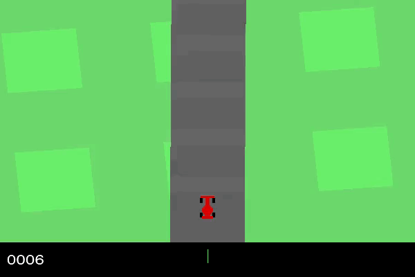
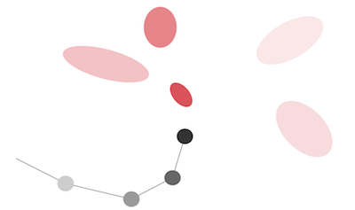
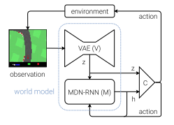

## Python과 Keras를 이용한 환각 딥강화학습
원문 : [Hallucinogenic Deep Reinforcement Learning Using Python and Keras](https://medium.com/applied-data-science/how-to-build-your-own-world-model-using-python-and-keras-64fb388ba459)
> 본 문서는 [World Models 논문](https://arxiv.org/abs/1803.10122)을 튜토리얼 형식으로 설명한 것으로, World Models의 대략적인 내용을 학습한 후 읽는 것을 권장합니다. 본 문서에 대한 번역자의 추가 설명은 `인용구`로 표시하였습니다.  

* Keras
* LSTM
* World Models

### 소개

인공지능에 관심이 있다면, World Models을 주목해야 합니다.  
[World Models 블로그](https://worldmodels.github.io/)  
[World Models 논문](https://arxiv.org/abs/1803.10122)  

이 모델은 세 가지 이유에서 걸작이라고 할 수 있는데,  
1. 몇 가지 딥러닝/강화학습 테크닉을 결합해서 놀라운 성과를 보였습니다. - 그 유명한 카레이싱 강화학습 환경을 처음으로 해결한 에이전트입니다.  
2. 매우 쉽게 쓰여져 최신 AI 기술에 관심있는 사람들에게 좋은 학습자료가 됩니다.  
3. 여러분 스스로 솔루션을 코드로 작성해볼 수 있습니다.  

**이 포스팅은 해당 논문의 내용을 순서대로 실습하는 튜토리얼입니다.**  

이 글에서는 기술적인 세부사항들 뿐만 아니라 여러분의 컴퓨터에서 동작하는 에이전트를 만들어 볼 수 있도록 안내할 것입니다 (저는 논문의 저자는 아니지만, 단지 이 놀라운 논문을 저의 해석대로 여러분들에게 공유하는 것입니다). 

### Step 1: 문제 정의

우리는 2차원의 트랙에서 운전하는 강화학습 알고리즘(이하 '에이전트')를 완성할 것이고, 카레이싱 환경은 [OpenAI Gym](https://gym.openai.com/envs/CarRacing-v0/)을 기반으로 합니다.  

각 단위시간마다, 에이전트는 64x64 픽셀의 컬러 이미지(자동차와 주변 환경)를 입력받아 다음 단계에서 취할 행동을 결과값으로 도출해야 합니다 - 구체적으로 핸들방향(-1 ~ 1), 가속(0 ~ 1), 브레이크(0 ~ 1) 값을 의미합니다.  

이 때, 에이전트가 취한 행동은 시뮬레이션 환경에 전달되어 에이전트는 새로운 이미지를 입력받게 되고 사이클이 다시 시작되게 됩니다.  

에이전트는 매 단위시간마다 -0.1씩, 트랙타일을 지날 때마다 +1000/N (N은 트랙타일의 총 개수)씩 보상을 받습니다. 예를 들어, 에이전트가 732 프레임만에 트랙을 완주했다면, 1000 - 0.1*732 = 926.8점을 얻게 됩니다.  

  

위의 예제는 처음 200 프레임 동안 [0, 1, 0]의 행동을 하고, 그 후 무작위로 움직이는 에이전트의 주행입니다. 좋지 않은 전략이라는 것이 눈에 보이죠?  

이 게임의 목표는 에이전트가 주변 정보를 활용해서 다음에 취할 최선의 행동을 학습하도록 하는 것입니다.  

### Step 2: 해결책  

논문의 저자들이 [World Models 블로그](https://worldmodels.github.io/)에 이 모델에 대해서 아주 잘 설명을 해놓았기 때문에, 저는 여기에서 세부사항을 모두 설명하지는 않을 것입니다. 대신에 모델의 각 부분들이 어떻게 합쳐지고, 실제 주행에 적용하였을 때에도 잘 동작하는 이유를 중심으로 설명하겠습니다.  

모델은 3가지 부분으로 구성되어 있고, 각각의 파트는 별개로 학습됩니다.  

#### A Variational Autoencoder(VAE)  

우리가 운전을 할 때, 눈에 보이는 모든 '픽셀(정보)'를 분석하면서 의사결정을 하지 않습니다. 대신 뇌에서는 시각 정보를 몇 가지의 정보(예를 들어, 직선 도로인지, 커브가 언제 시작하는지 등)로 압축하여 처리하여 다음에 취할 행동을 결정합니다.  

VAE도 이와 마찬가지로 64x64x3 크기의 RGB 이미지 정보를 가우시안 분포를 따르는 32차원의 벡터 z로 압축하는 역할을 합니다. VAE를 사용하게 되면 에이전트는 주변 환경을 z개의 대표값 만으로도 이해할 수 있기 때문에 훨씬 효율적으로 학습할 수 있습니다.  

#### A Recurrent Neural Network with Mixture Density Network output layer (MDN-RNN)  

  

만약 모델에 MDN-RNN을 사용하지 않는다면, 에이전트는 아마 위의 영상처럼 운전하게 될 것입니다.  

우리가 운전할 때를 떠올려 봅시다. 좌회전을 해야한다고 판단하고 실제로 핸들을 왼쪽으로 틀었을 때, 우리는 자동차가 계속해서 차선을 따라갈 것이라고 기대합니다. 즉, 상황 판단 후 어떠한 행동을 취했을 때 예상 밖의 일이 벌어지지는 않는다는 것입니다.  

다음 단계의 상황을 예측하는 것이 RNN-특히 LSTM(Long Short-Term Memory Network)-의 역할입니다. 이 모델에서는 크기 256의 은닉층(h)을 가진 LSTM을 사용합니다.  

VAE와 같이 RNN도 현재 주변 상황에 대한 정보를 표현하지만 이에 더해 이전 단계의 z와 행동을 기반으로 다음 단계의 z도 예측합니다. MDN의 출력층을 사용하여 몇 개의 가우시안 분포 중 하나에서 다음 단계의 z를 도출할 수 있습니다. 

  
이 기법은 동일 저자의 [손글씨 생성 문제](http://blog.otoro.net/2015/12/28/recurrent-net-dreams-up-fake-chinese-characters-in-vector-format-with-tensorflow/)에서도 사용되었는데, 손글씨를 생성할 때 펜이 다음으로 위치할 지점을 빨간 색의 가우시안 분포로 나타냅니다.  

이와 유사하게 World Models 논문에서는 다음 단계의 상태를 5개의 가우시안 분포 중 하나에서 도출합니다.  


#### Controller

눈치채셨는지 모르겠지만 지금까지는 어떤 행동을 취할지 결정하는 방법에 대해서는 언급하지 않았습니다. 행동을 결정하는 것은 컨트롤러의 몫입니다.  

Controller(컨트롤러)는 간단히 말해 신경망(densely connected neural network)입니다. VAE에서 도출된 크기 32의 상태(z)와 크기 256의 RNN의 은닉층을 연결하여 입력값으로 사용하고, 출력값은 크기 3으로 에이전트가 취할 수 있는 3가지 행동을 특정한 범위값으로 나타냅니다.  

---
#### 도표 

위에서 설명한 3가지 요소가 어떤 역할을 하고 어떻게 유기적으로 동작하는지 아래 도표로 살펴봅시다.  

  
Diagram of the World Model architecture (source: https://arxiv.org/pdf/1803.10122.pdf)  

- VAE: (64x64x3 크기의 최신 이미지를 보면서) 차는 도로 주행 방향을 바라보고 있고, 현재는 직선 도로이지만, 곧 왼쪽 커브가 나타날 것이라는 사실을 z에 표현합니다.  
- RNN: VAE에서 도출된 상태값(z)과 이전 단계에서 가속을 했다는 사실을 바탕으로 은닉층(h)를 업데이트 합니다. 업데이트된 h로 다음 상태를 예측할 때 도로 위에 있지만 살짝 왼쪽으로 틀어진 상태가 됩니다.  
- Controller: VAE에서 도출된 상태값(z)와 RNN의 은닉층(h)을 바탕으로 신경망의 출력값을 계산하여 [0.34, 0.8, 0]이라는 값을 얻어냅니다.  
---

이제 우리만의 카레이싱 에이전트를 학습시키기 위한 환경설정을 할 차례입니다!  


### Step 3: 환경 설정

높은 성능의 컴퓨터가 있지 않다면 [Google Cloud Compute](https://cloud.google.com/compute/)를 사용하는 것을 권장합니다.  

아래 실습은 리눅스(우분투 16.04) 환경에서 테스트 되었습니다 - Mac이나 윈도우를 사용하신다면 패키지 설치에 필요한 몇 가지 명령어만 수정하시면 됩니다.  

#### 1. 레포지토리 복사하기

명령창에서 프로젝트를 저장하고 싶은 폴더로 이동한 후 아래 레포지토리를 복사합니다.  

```sh
git clone https://github.com/AppliedDataSciencePartners/WorldModels.git
```

이 프로젝트는 World Models 논문의 저자인 David Ha가 개발한 `estool library`를 사용하고 있으며, 신경망 구현을 위해서는 Tensorflow 백엔드의 Keras를 사용합니다(원 논문에서는 Tensorflow만 사용하였습니다).

#### 2. 가상 환경 설정하기

파이썬 3 가상환경을 생성합니다(저는 `virtualenv`와 'virtualenvwrapper'를 사용했습니다).

```sh
sudo apt-get update
sudo apt-get install python-pip
sudo pip install virtualenv
sudo pip install virtualenvwrapper
export WORKON_HOME=~/.virtualenvs
source /usr/local/bin/virtualenvwrapper.sh
mkvirtualenv --python=/usr/bin/python3 worldmodels
```

#### 3. 패키지 설치하기

```sh
sudo apt-get install cmake swig python3-dev zlib1g-dev python-opengl mpich xvfb xserver-xephyr vnc4server
```

#### 4. requirements.txt 설치하기

```sh
cd WorldModels
pip install -r requirements.txt
```

여기까지 잘 따라오셨다면 카레이싱 예제를 위한 패키지는 모두 설치되었습니다. OpenAI Gym의 다른 예제를 시도해보고 싶으시다면 추가적인 패키지를 설치해야 할 수도 있습니다 (https://gym.openai.com/envs/#classic_control 를 참고하세요)  


### Step 4: 무작위 데이터 생성

카레이싱 예제에서 VAE와 RNN은 `무작위 롤아웃(rollout) 데이터`-무작위로 취한 행동으로 얻어진 환경(관찰) 데이터-가 필요합니다. 사실, 우리는 유사-랜덤(pseudo-random) 행동을 취하게 됩니다. 왜냐하면 게임이 시작되면 무조건 가속하여 차가 일단 출발할 수 있도록 해야하기 때문입니다.  

VAE와 RNN은 Controller와 독립적이기 때문에, 학습 데이터를 생성할 때 되도록 다양한 상황의 데이터(a diverse range of observations)를 생성하고, 여러가지 행동(a diverse range of actions)을 취해보아야 한다는 점만 신경쓰시면 됩니다.  

무작위 롤아웃 데이터를 생성할 때는, 아래와 같이 스크립트를 실행합니다.  

```sh
# 화면이 있을 때
python 01_generate_data.py car_racing --total_episodes 2000 --start_batch 0 --time_steps 300

# 화면이 없는 서버 등에서 실행할 때
xvfb-run -a -s "-screen 0 1400x900x24" python 01_generate_data.py car_racing --total_episodes 2000 --start_batch 0 --time_steps 300
```

위의 스크립트를 실행하면 총 2000번의 롤아웃(200개씩 10개(0번~9번)의 batch)을 시행하고, 각 롤아웃은 최대 300 스텝까지 움직입니다.  

`./data` 폴더에는 두 종류의 데이터가 저장되는데 (\*은 배치번호를 나타냅니다),
- `obs_data_*.npy` : 64x64x3 크기의 이미지들을 numpy array 형태로 저장
- `action_data_*.npy` : 3차원 벡터의 행동 정보  


### Step 5: VAE 학습

VAE를 학습시킬 때는 `obs_data_*.npy` 데이터를 사용합니다. 4단계가 완료되고 `./data` 폴더에 데이터가 저장된 것을 확인하고 진행해주세요.  

명령창에서 아래 스크립트를 실행합니다.  

```sh
python 02_train_vae.py --start_batch 0 --max_batch 9 --new_model
```

위의 스크립트는 0 ~ 9번 배치를 사용하여 새로운 VAE를 도출하고 결과를 `./vae/weights.h5`에 저장합니다. `--new_model` 옵션은 VAE 모델을 처음부터 다시 학습시키라는 의미입니다.  

`./vae/weights.h5` 존재하고 `--new_model` 옵션이 없다면, 스크립트는 기존의 모델을 로드하여 학습시킵니다. 이 방법을 사용하면 모델을 계속해서 반복적으로 학습시킬 수 있습니다.  

VAE 모델의 구조는 `./vae/arch.py`에서 확인할 수 있습니다.  

### Step 6: RNN 데이터 생성

학습시킨 VAE를 RNN의 학습데이터를 생성하는 데에 사용합니다. RNN은 VAE를 사용하여 변환된 이미지 데이터(z)와 행동(a)를 입력값으로 사용하고, 다음 단계의 z를 출력값으로 계산합니다.  

아래 스크립트를 실행하여 RNN 데이터를 생성할 수 있습니다.  

```sh
python 03_generate_rnn_data.py --start_batch 0 --max_batch 9
```

위의 스크립트는 `obs_data_*.npy`와 `action_data_*.npy` 데이터를 RNN 학습에 알맞은 형태로 변형시키는 작업을 합니다.  
작업 결과는 2가지 데이터로 `./data` 폴더에 저장됩니다(\*는 배치번호를 나타냅니다).  
- `rnn_input_*.npy` : [z a] concatenation 형태의 벡터 데이터
- `rnn_output_*.npy` : 다음 단계의 z값


### Step 7: RNN 학습

RNN을 학습시킬 때는 `rnn_input_*.npy`와 `rnn_output_*.npy`를 사용합니다. 6단계가 완료되고, `./data` 폴더에 파일이 제대로 생성되었는지 확인 후 진행해주세요.  

명령창에서 아래와 같이 스크립트를 실행합니다.  

```sh
python 04_train_rnn.py --start_batch 0 --max_batch 9 --new_model
```

이 스크립트는 0~9번 배치의 데이터를 사용하여 RNN을 학습시킵니다. 학습 결과는 `./rnn/weights.h5`에 저장되고, `--new_model` 옵션은 역시 모델을 처음부터 학습시키는 명령어입니다.  

VAE와 마찬가지로, `weights.h5`이 이미 존재하고 `--new_model` 옵션이 없다면, 기존의 모델을 로드하여 학습시켜 모델을 반복적으로 학습시킬 수 있습니다.  
RNN 구조는 `./rnn/arch.py`에서 확인 할 수 있습니다.  


### Step 8: 컨트롤러(Controller) 학습

드디어 재미있는 부분이 나왔습니다!  

지금까지 우리가 한 것은 이미지 데이터를 압축해서 표현할 수 있는 VAE를 구성하고, 다음 단계의 z를 예측하는 데 사용되는 RNN을 학습시키는 것이었습니다. 이 두 가지를 학습시키기 위해서 트레이닝셋을 직접 생성하기도 했습니다.  

컨트롤러를 학습시키기 위해서는 CMA-ES(Covariance Matrix Adaptation — Evolution Strategy)라는 알고리즘을 사용한 강화학습을 적용할 것입니다.  

입력값은 크기 288(32(z) + 256(h))의 벡터이고, 출력값은 크기 3의 벡터이기 때문에, 288 * 3 + 1(bias) = 총 867개의 파라미터를 학습시켜야 합니다.  

CMA-ES는 먼저 임의로 초기화된 867개의 파라미터('population')를 여러 벌 생성합니다. 그런 다음 각 파라미터를 사용하여 평균 점수를 계산합니다. 자연선택의 과정과 같이 가장 높은 점수를 도출해 낸 파라미터들만이 선택되어 다음 계산에 사용됩니다.  

아래 스크립트를 실행하여 컨트롤러를 학습시킬 수 있습니다 (여러분의 상황에 맞게 값을 조정하여 실행하시면 됩니다).

```sh
# 화면이 있을 때
python 05_train_controller.py car_racing --num_worker 16 --num_worker_trial 2 --num_episode 4 --max_length 1000 --eval_steps 25

# 화면이 없는 서버 등의 환경일 때
xvfb-run -s "-screen 0 1400x900x24" python 05_train_controller.py car_racing --num_worker 16 --num_worker_trial 2 --num_episode 4 --max_length 1000 --eval_steps 25
```

- `--num_worker 16` : 최대 코어 수까지만 설정하도록 합니다.
- `--num_work_trial 2` : 각 코어에서 테스트할 파라미터의 개수 (`num_worker * num_work_trial`의 값이 전체 population의 사이즈)
- `--num_episode 4` : 파라미터의 평균 점수를 계산할 에피소드 수 (매 n번 에피소드마다 평균 점수를 계산)
- `--max_length 1000` : 각 에피소드에서의 최대 타임-스텝
- `--eval_steps 25` : 매 n번마다 최적의 파라미터를 평가(최대 100 에피소드)
- `--init_opt ./controller/car_racing.cma.4.32.es.pk` : 기본적으로 컨트롤러는 모델을 매번 처음부터 학습하고 `controller` 폴더에 값을 저장합니다. 이 옵션을 사용함으로써 기존에 학습된 모델(파일을 특정)을 재사용하여 학습할 수 있습니다.  

매 세대마다 `./controller` 폴더에 현재까지의 최적 모델이 저장됩니다.   

### Step 9: 시각화

이 글이 작성된 시점에서는 200 세대 이후 평균 833.13점까지 에이전트가 학습하였습니다. Google Cloud Platform에서 Ubuntu 16.04, 18 vCPU, 67.5GB RAM 환경 하에서 학습을 진행하였고, 주요 파라미터는 튜토리얼에 사용된 그대로 사용되었습니다.  

논문의 저자는 2000 세대 이후 평균 906점까지 학습하였으며, 현재까지의 최고 점수라고 알려져 있는데, 이들은 조금 더 개선된 환경에서 학습을 진행하였습니다 (학습 데이터 : 10000 에피소드, Population: 64, 코어: 64, 16 에피소드/trial)  

여러분의 에이전트 학습 현황을 시각화하려면, 아래 스크립트를 실행합니다.  
```sh
python model.py car_racing --filename ./controller/car_racing.cma.4.32.best.json --render_mode --record_video
```  

- `filename` : 컨트롤러에 전달할 모델의 JSON 파일
- `render_mode` : 렌더링 여부
- `--record_video` : 비디오 출력 여부 (`./video` 폴더에 mp4 형태로 저장)
- `final_mode` : 100 에피소드 테스트 후 평균 점수를 출력

데모영상을 보시죠!  

  

### Step 10: 환각 학습

지금까지 내용만으로도 멋진데, 논문의 뒷부분은 훨씬 인상적입니다.  

논문은 계속해서 [DoomTakeCover](https://github.com/ppaquette/gym-doom) 게임 환경을 사용한 놀라운 성과를 보여주는데, 에이전트는 불덩이를 피하면서 계속해서 살아남습니다.  

저자는 시뮬레이션 환경이 아닌 환각적인 꿈 안에서도 에이전트가 VAE/RNN을 사용하여 스스로 동작하는 방법을 학습할 수 있다고 주장합니다.  

여기에서 추가되는 것은 RNN이 다음 단계에서 에이전트가 죽을(게임이 끝날) 확률을 같이 예측한다는 것입니다. 이런 식으로 VAE/RNN의 조합은 환경 정보를 종합하고 컨트롤러를 학습하는 데에 사용됩니다. 이것이 `World Models`의 주요 개념입니다.  

---
환각 학습에 대해서 아래와 같이 정리할 수 있습니다.  

>에이전트의 초기 학습 데이터는 환경에서의 랜덤 반응에 불과하지만, 이를 바탕으로 환경이 어떻게 동작하는지(그룹핑, 물리적인 요소 그리고 본인의 행동이 어떤 영향을 주는지 등) 파악할 수 있다.  

> 이러한 이해를 바탕으로 에이전트는 주어진 작업에 대해 최적의 전략을 짤 수 있다. 실제 환경에서 테스트할 필요도 없는데, 이는 스스로 구축한 환경에 대한 모델(mental model of the environment)에서 이리저리 테스트해 볼 수 있기 때문이다.  


갓난아기가 걷는 방법을 깨우치는 것과 비슷한데, 단순한 유추보다 더 깊은 유사점들이 존재하기 때문에, 이것은 정말로 흥미로운 연구 분야이다.

---


> 이 글은 2018 컨트리뷰톤에서 `Contribute to Keras` 프로젝트로 진행했습니다.  
Translator: [조아라](https://github.com/ahracho)  
Translator email : ahracho89@gmail.com  


