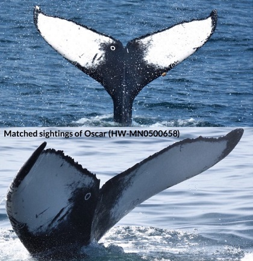

## Python과 Keras를 활용한 고래 식별 딥러닝

[Humpback Whale Identification Challenge on Kaggle (원문 바로가기)](https://medium.com/@evily.yang/humpback-whale-identification-challenge-on-kaggle-7c550a342df3)  

> 이 글은 저자가 Kaggle의 고래 식별 대회에 참여한 경험을 바탕으로 하고 있습니다. Keras를 활용하여 딥러닝으로 이미지 식별 문제를 해결한 과정을 설명하고, 과정에서 겪었던 어려움들을 서술하고 있습니다.  

* 딥러닝
* CNN
* AutoEncoder

[캐글 대회 링크 바로가기](https://www.kaggle.com/c/whale-categorization-playground/leaderboard)

### 요약

#### 도구 (Tools)
- 파이썬
- 케라스
- 텐서플로우
- GPU 2개

#### 사용 기법 (Methods)
- 오토인코더 (Auto Encoder)
- 합성곱 신경망 (CNN) : VGG19, ResNet50
- 트랜스퍼 러닝 (Transfer Learning)
- 로스(Loss) 함수에 다른 클래스 가중치 사용하기
- 데이터 수 늘이기 (Data Augmentation)

#### 해결된 문제
- 224x224 보다 큰 이미지 처리
- 케라스로 여러 개 GPU 사용하기

#### 해결 안 된 문제
- 데이터 불균형 문제
- 낮은 정확도 (점수 : 0.32653, 벤치마크 : 0.36075 보다 낮음)

### 개요

  
[이미지 출처](https://medium.com/@evily.yang/humpback-whale-identification-challenge-on-kaggle-7c550a342df3)  

고래 감시 시스템을 사용하여 고래들의 활동을 추적할 때 종(Species)을 자동으로 분류하는 시스템이 필요하다. 이 글에서 다루는 캐글 대회는 제공된 고래 꼬리 이미지를 기반으로 종을 분류하는 것을 목표로 한다.  

제공된 트레인 셋은 4251종(클래스), 9850개의 이미지로 구성되어 심한 클래스 불균형을 보인다 (2220개의 클래스는 샘플 이미지가 단 한 장만이 제공된다). 이러한 데이터 불균형을 해결하기 위해서 데이터 수 늘이기(Data Augmentation) 기법과 로스(Loss) 함수에 클래스마다 다른 가중치를 적용하였다.  

게다가 트레인 셋의 모든 이미지는 CNN의 기본 입력 사이즈인 224x224보다 크다 (데이터의 11%는 크기가 1050x600 이다). 이를 해결하기 위해 오토 인코더(Auto Encoder)를 사용하여 큰 사이즈의 이미지를 CNN 기본 입력 사이즈로 변환하였다. 하지만 데이터 불균형이 심했기 때문에 오토 인코더으로 인한 성능의 향상을 정확하게 측정할 수는 없었다.  

테스트 셋은 총 15610개의 이미지로 구성되어 있다. 이 대회에서는 5가지 종류를 분류하고, mAP(Mean Average Precision)을 지표로 평가한다.    

> mAP 설명 추가

### 데이터 불러오기

### 데이터 처리하기

### 오토인코더 (Auto Encoder)

### 이미지 분류

### 결론

### 참고문서
* [참고 사이트 1]()
* [참고 사이트 2]()

