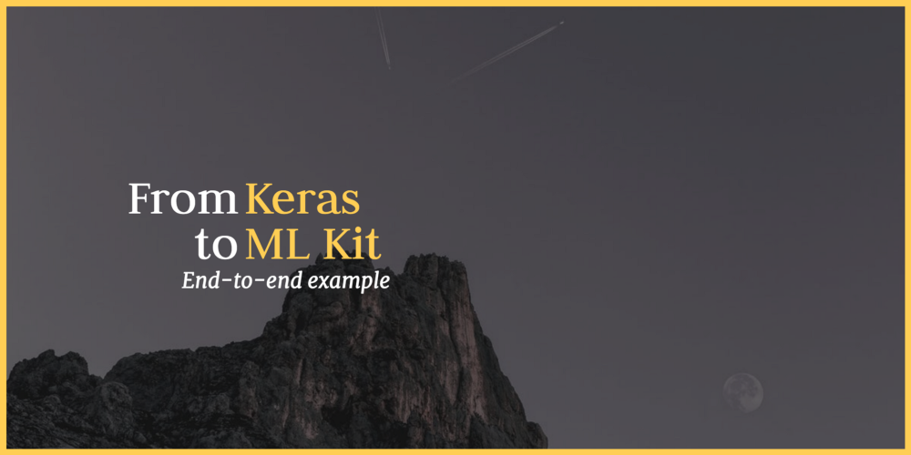
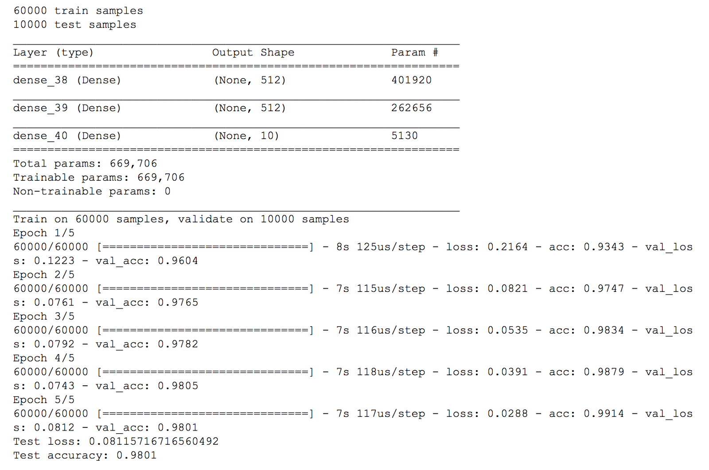
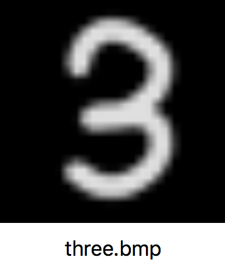
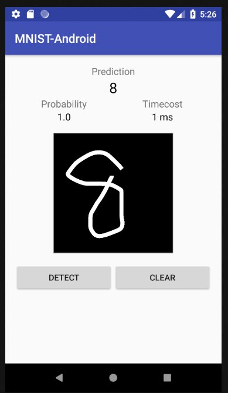

## Keras와 ML Kit을 활용한 손 글씨 숫자 인식하기(feat.Android)

[From Keras to ML Kit 원문 바로가기](https://proandroiddev.com/from-keras-to-ml-kit-eeaf578a01df)

>  이 튜토리얼의 목적은 Keras모델과 안드로이드를 이용하여 모바일 머신러닝을 구현함에 있습니다. <br>
머신러닝의 유명한 데이터 셋 MNIST를 이용하여 모델을 학습하고, 학습시킨 모델을 안드로이드에 올려서 <br>
  전체적인 과정은 다음과 같습니다. <br>
    1. MNIST데이터 셋을 이용하여 Keras로 예측 모델 만들기
    2. Keras모델을 TF lite 모델로 변환하기
    3. 변환된 TF Lite모델을 다운받고 ML Kit에 올리기
  안드로이드 구현함에 있어서 원작자는 이미지 파일을 미리 업로드 시켜 구현하였습니다. <br>
  번역자인 저는 원작자와 다른 방식으로 이미지 파일이 아닌 직접 손 글씨를 작성하여 Android에서 예측할 수 있도록 구현하였습니다. 맨 아래 부분에 추가했으니 참고해보세요. 재밌습니다 :)


* Keras
* ML Kit
* TensorFlow Lite
* Android

<br>



<br>
### From Keras to ML Kit
> Keras모델을 생성, 학습하고 내보내어 ML Kit에 작동할 수 있도록 만든 End-to-end 예시입니다.

<p>
이 튜토리얼은 제가 쓴 ML Kit 시리즈 중 에 한 예시입니다.
<p>
<u>[TensorFlow 모델 ML Kit 으로 export하기](https://proandroiddev.com/exporting-tensorflow-models-to-ml-kit-bce13b914f31)</u>는 여러분이 Python 코드로 작성한 모델을 export하기 쉽게 작성한 튜토리얼입니다. 이 튜토리얼에서는 온라인에서 볼 수 있는 다른 예시들보다 설치, 과정들이 많지 않습니다.

<p>
<u>[커스텀한 TensorFlow 모델들 ML Kit에 올리기: 입력과 출력 이해하기](https://proandroiddev.com/custom-tensorflow-models-on-ml-kit-understanding-input-and-output-ca0b2c27be5f)</u>는 ML Kit을 사용하여 export시킨 모델을 안드로이드 앱에 로드시켰습니다. 이 튜토리얼에서는 ML Kit 예제 코드를 자세히 살펴보고 적절한 입력 및 출력을 구성하는 방법을 알 수 있습니다.

<p>
오늘 저는 다음 질문에 답하려고 노력할 것입니다.

<br>
### How can I use my Keras model with ML Kit?
<p>
Keras는 TensorFlow 위에서 작동할 수 있는 파이썬 기반의 신경망 라이브러리 오픈소스 입니다. TensorFlow와 완벽하게 호환되면서 TensorFlow의 세부사항을 추상화합니다. 신경망 공부를 시작하게 되면 더 많이 사용하게 될 것입니다.

<p>
이 튜토리얼에서는 [Keras repository](https://github.com/keras-team/keras/blob/master/examples/mnist_mlp.py)에 있는 기본적인 예제를 저의 [Jupyter Notebook](https://github.com/miquelbeltran/deep-learning/blob/master/android-mlkit-sample/Keras%20Sample.ipynb)을 통해 살펴볼 것 입니다.
<br>
이번 예제에서 Keras 원작자는 MNIST 데이터 셋으로부터 손 글씨 숫자를 읽을 수 있는 모델을 만들었습니다. MNIST 데이터 셋은 머신 러닝에서 많이 사용되는 데이터 셋이며, 저는 이것을 이용하여 [myFace Generator 프로젝트](https://proandroiddev.com/deep-learning-nd-face-generator-fa92ddbb8c4a)를 진행했었습니다.
<br>


자세히 살펴봅시다. 아래의 코드는 Keras로 모델을 생성하는 부분입니다.
```python
model = Sequential()

model.add(Dense(512, activation='relu', input_dim=784))
#model.add(Dropout(0.2))
model.add(Dense(512, activation='relu'))
#model.add(Dropout(0.2))
model.add(Dense(num_classes, activation='softmax'))

model.summary()
```

이 모델은 세 개의 레이어로 단순하게 구성되어 있습니다. 입력 차원은 784차원이며, 출력 차원은 10개의 클래스에 해당하는 10차원이고, 각각 완전 연결 레이어로 구성되어 있습니다.
참고로 원본 샘플의 드롭 아웃은 주석 처리했는데 그 이유는 나중에 설명하겠습니다.
> MNIST데이터 셋의 이미지 크기는 28X28인 2차원입니다. 이를 완전 연결 레이어에 적용시키기 위해선 1X784인 1차원으로 리사이징 해야합니다.


---

### Training the model
<p>
학습 과정은 주피터 노트북에서 확인할 수 있습니다. [Keras Sample](https://github.com/miquelbeltran/deep-learning/blob/master/android-mlkit-sample/Keras%20Sample.ipynb)
<br>
결과는 다음과 같습니다.



이 모델의 정확도는 0.98이며 우수하지는 않습니다. 저는 오직 5에폭만 학습시켰고, 드롭 아웃 레이어를 뺏기 때문에 원래의 예제에 비해 정확도가 약간 떨어졌습니다.

---

### Exporting a Keras model
<p>
모델 훈련을 마친 후, Keras 모델을 TF Lite모델로 변환해야 합니다. [TensorFlow 모델을 ML Kit으로  export하기](https://proandroiddev.com/exporting-tensorflow-models-to-ml-kit-bce13b914f31)와 같은 과정이지만 추가적인 과정이 필요합니다. <br>


```python
from keras import backend as K

custom_input_tensor = tf.placeholder(tf.float32, shape=(1, 784))
output_tensor = model(custom_input_tensor)

frozen_graph = freeze_session(K.get_session(), output_names[output_tensor.op.name])

tflite_model = tf.contrib.lite.toco_convert(frozen_graph,[custom_input_tensor], [output_tensor])
open("app/src/main/assets/nmist_mlp.tflite", "wb").write(tflite_model)
```

Keras모델을 입력 텐서로 감싸고, 출력 텐서를 구해야 합니다. 우리는 이 텐서들을 ML Kit의 입력과 출력으로 사용합니다.

<br>`freeze_session` 전에, 입력 텐서로 `(1, 784)`벡터의 TensorFlow의 `placeholder`를 정의하였습니다. 그리고 나서 Keras로 만든 `model`을 가지고 입력 텐서를 인자값으로 넣어줍니다. 결과 값은 `output_tensor`입니다.

<br>두번째로, `freeze_session`을 호출합니다. 이것은 링크로 걸어놓은 나의 예전 글에 나와있습니다. 하지만 이번에는 Keras 뒷단으로 부터 TensorFlow세션을 반환하는 `K.get_session()`을 호출합니다.

<br>마지막으로, 방금 만든 입력과 출력 텐서를 `toco_convert`메소드에 전달하고, 변수를 고정시켜서 모델을 ```tflite```파일에 저장합니다.

<br>그러나, 원래 모델은 잠시동안 **TF Lite가 지원하지 않는**`Dropout`을 사용하였습니다. 저는 원래의 모델을 내보내는 과정에서 문제가 생겼었는데, 드롭아웃 레이어를 제거하니깐 해결되었습니다. 저는 TensorFlow의 다음 버전에서 이 문제가 해결되길 기대합니다.

---


### Running on a Google Colab
<p>
이 과정을 [Jupyter Notebook](https://github.com/miquelbeltran/deep-learning/blob/master/android-mlkit-sample/Keras%20Sample.ipynb)을 통해 똑같이 구현할 수 있습니다. [Google Colab](https://colab.research.google.com/)에서 을 통해  GPU 가속을 사용하여 무료로 사용해보세요. 방법은 [notebook](https://github.com/miquelbeltran/deep-learning/blob/master/android-mlkit-sample/Keras%20Sample.ipynb)을 다운로드하고 Google Colab에서 열면 됩니다.
<br>
만약 Google Colab에서 만든 모델을 내보내고 싶다면, 내보내기 단계에서 파일 경로를 변경하고 `files.download`를 호출하면 됩니다. 그러면 브라우저에서 파일 다운로드가 시작됩니다.
<br>

```python
from google.colab import files
...
open("nmist_mlp.tflite", "wb").write(tflite_model)
files.download('nmist_mlp.tflite')
```
---
### Running the exported model on Android
<p>
우리의 모델이 실제로 작동하는지 보기위해서 Android Studio로 가보겠습니다.
<p>
이 모델이 실행되는 액티비티는 <u>[MnistActivity.kt](https://github.com/miquelbeltran/deep-learning/blob/master/android-mlkit-sample/app/src/main/java/work/beltran/mlkitsample/MnistActivity.kt)</u> 에서 열 수 있습니다.
<p>
```java
// 입력 : 1x784 텐서
val inputDims = intArrayOf(1, 784)
// 출력 : 1x10 텐서
val outputDims = intArrayOf(1, 10)
```
<p>
이를 테스트하기 위해 손으로 숫자 3을 써서 색상을 뒤집어 회색 스케일 비트 맵으로 변환했습니다.
> 색상을 뒤집은 이유는 MNIST 데이터 셋의 이미지들이 검은색 배경에 흰색 손 글씨 숫자가 써있기 때문입니다.



<br>
두번째, 비트맵을 받고 하나의 0과 1 사이의 실수 배열로 변환하는 과정이 필요합니다.
<p>
```java
// ML Kit Input
val inp = arrayOf(FloatArray(784) { 0f })

// Read our Bitmap
val bitmap = BitmapFactory.decodeStream(assets.open("three.bmp"))

// Read pixels
val intValues = IntArray(784)
bitmap.getPixels(intValues, 0, bitmap.width, 0, 0, bitmap.width, bitmap.height)

intValues.forEachIndexed { index, i ->
    // Take one color channel, convert it to float, and divide it by 265 to obtain a [0, 1] value
    val f = (i and 0xFF).toFloat()
    inp[0][index] = f / 256
}

// Pass the inputs
val inputs = FirebaseModelInputs.Builder().add(inp).build()
```
<p>
이제 입력을 가지고 모델을 실행할 시간입니다.
<p>
```java
interpreter.run(inputs, dataOptions)
    .continueWith { task ->
         val output = task.result.getOutput<Array<FloatArray>>(0)
    }
```
<p>
출력 배열을 확인했을 때, 다음과 같은 결과를 얻었습니다.
<p>
```
7.771087E-15,
3.1033683E-13,
1.7879811E-9,
0.9999988,
3.5368996E-16,
5.594893E-7,
8.98838E-16,
3.1935377E-12,
5.8121117E-7,
3.0227494E-9
```
<p>
결과 값을 살펴보면, 우리는 출력 배열의 3번째 위치하고 있는 0.999의 값을 얻었습니다. 이것은 **숫자3의 카테고리와 일치합니다!** 우리가 만든 모델이 Android에서 작동하네요!
> 배열의 위치는 0부터 시작하기 때문에 순서대로 0, 1, 2, 3이여서 3번째 위치라고 표현합니다 <br>
> `E-숫자`에서 예를들어 E-15는 10^(-15)로 굉장히 작은 숫자 입니다.

<br>
**이 시리즈가 TensorFlow, Keras 및 ML Kit가 어떻게 함께 작동하는지 이해하는데 도움이 되었기를 바랍니다.** 추가적인 도움이 필요하다면 도와 드리겠습니다! 저는 모바일 및 머신러닝에서 프리랜서 기회를 찾고 있습니다. <u>http://beltran.work/with-me/</u>

---


>  여기부터는 이 튜토리얼의 일부분과 다른 튜토리얼의 일부분을 참고하여 만든 것입니다. 최종 데모는 위의 이미지와 같습니다.<p>
 [[MLkit_MNIST_Keras]](https://colab.research.google.com/drive/1J8HieLqMCIdVmNq1hz7FzuHOW-XduZ00) Keras모델 생성, 학습, 내보내기, 모델을 모바일에 올리기 위한 다운로드 과정을 직접 따라해보며 만든 Colab파일입니다. 별다른 설치없이 바로 실행시킬 수 있습니다.<p>
이 튜로리얼에서는 전반적인 로직만 살펴 보겠습니다. 최종 구현에 대한 코드와 상세 설명은 저의 깃허브 [AI-project/Handwritten digit recognition](https://github.com/SooDevv/AI-project/tree/master/Handwritten%20digit%20recognition)에서 확인할 수 있으며, 안드로이드 구현은 Java를 기반으로 하였습니다. [MNIST with TensorFlow Lite on Android](https://github.com/nex3z/tflite-mnist-android/blob/master/README.md)를 참고하였습니다. <p>


>0. 분류 모델과 안드로이드를 연결하는 **Classifier** 클래스,최종결과를 반환하는 **Result** 클래스와 유저와 상호작용하는 **MainActivity** 로 구성되어 있습니다.
>1. 앞 서 만든 손글씨 숫자 분류 모델을 안드로이드에 올립니다.
  - `/android/app/src/main/assets`디렉토리를 생성하여  mnist_mlp.tflite파일을 저장합니다.<p>
>2. Classifier Class
 - mnist_mlp.tflite파일을 읽어 사전에 훈련 된 TensoFlow Lite 모델을 캡슐화하는 Interpreter에 로드합니다.<p>
 - 사용자로 부터 입력받은 손 글씨 숫자 이미지를 전처리 하는 과정이 포함되어있습니다.<p>
>3. Result Class<br>
  - Classifier class로 부터 받은 결과를 정의하는 클래스 입니다. <p>
  - `Prediction`은 제일 높은 확률 값을 가진 결과값을 나타냅니다. 즉, 어떤 숫자를 썻는지 맞추는 영역이죠.<p>
  - `Probability`는 결과값의 확률을 나타냅니다.<p>
  - `Timecost`는 입력 받은 손글씨로 부터 결과값을 내기위해 걸린 시간을 나타냅니다.<p>
>4. Main Activity
  - 데이터 셋과 동일한 환경을 맞추기 위해 검은색 배경화면에 흰 글씨로 숫자를 적습니다. <p>
  - `Detect` 버튼을 클릭하면, 그린 손글씨 숫자 이미지가 Classifier에 의해 분류되고, 결과를 확인할 수 있습니다. <p>
  - `Clear` 버튼을 클릭하면, 다시 손글씨를 작성할 수 있는 새 도화지가 됩니다.

<br>
### 참고문서
* [케라스 공식 홈페이지]()
* [김태영님의 케라스 블로그](https://tykimos.github.io/)
* [MNIST with TensorFlow Lite on Android](https://github.com/nex3z/tflite-mnist-android/blob/master/README.md)

> 이 글은 2018 컨트리뷰톤에서 [Contribute to Keras](https://github.com/KerasKorea/KEKOxTutorial) 프로젝트로 진행했습니다. <br>
> Translator : [김수정](https://github.com/SooDevv) <br>
> Translator email : [soojung.dev@gmail.com](soojung.dev@gmail.com)
