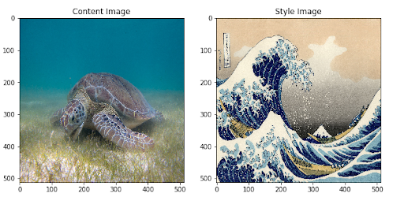
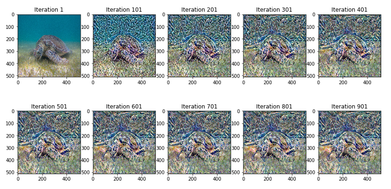
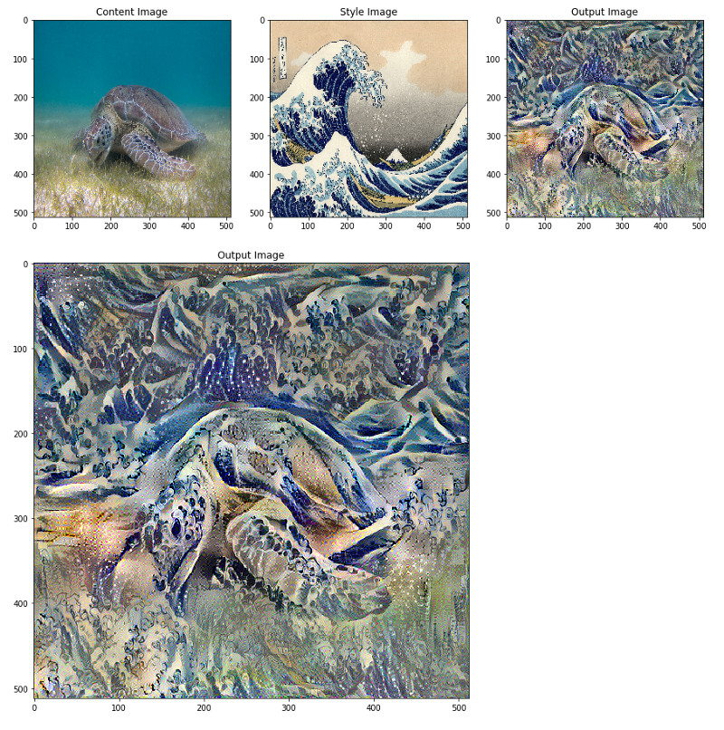
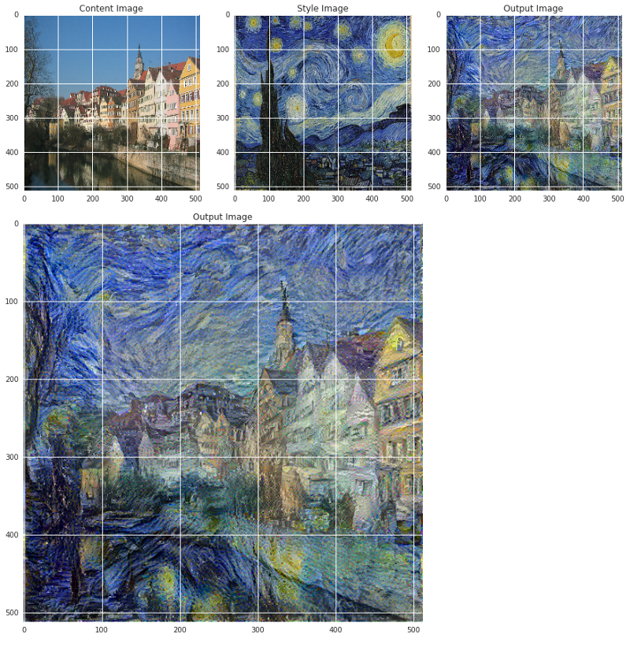
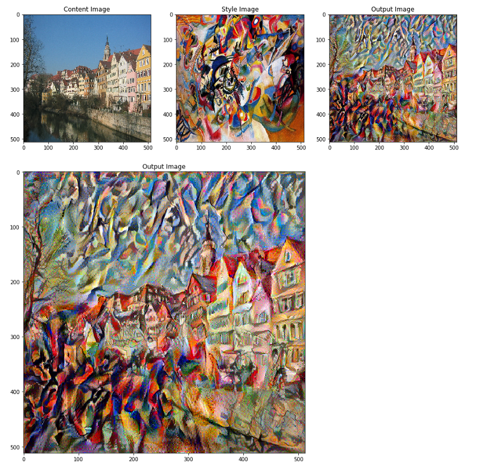

## Neural Style Transfer : tf.keras와 eager execution를 이용한 딥러닝 미술 작품 만들기(Neural Style Transfer: Creating Art with Deep Learning using tf.keras and eager execution)
[원문 링크](https://medium.com/tensorflow/neural-style-transfer-creating-art-with-deep-learning-using-tf-keras-and-eager-execution-7d541ac31398)
> 이 글은 Tensorflow의 Raymond Yuan가 작성한 글로 tf.keras와 eager execution을 이용해 입력 이미지를 특정 미술 작품의 스타일로 변화시키는 딥러닝 튜토리얼입니다.

* keras
* eager execution
* style transfer
* convolution neural network

### 주요 개념 설명
[이 글](https://colab.sandbox.google.com/github/tensorflow/models/blob/master/research/nst_blogpost/4_Neural_Style_Transfer_with_Eager_Execution.ipynb)을 통해 어떻게 딥러닝으로 다른 이미지의 스타일로 이미지를 재구성하는지 알아봅시다 (그대가 피카소 혹은 고흐처럼 그림을 그리길 원한다면). 이는 **Neural style transfer**로 알려져 있습니다. [예술 스타일의 신경 알고리즘](https://arxiv.org/abs/1508.06576) 이라는 Leon A. Gatys의 논문에 서술되 있습니다. 이 알고리즘은 훌륭한 읽을 거리이기에 반드시 확인을 해야합니다.

Neural style transfer는 컨텐츠 이미지, 스타일 참조용 이미지(마치 유명화가의 예술 작품같은) 그리고 스타일을 적용할 입력 이미지, 총 3가지 이미지를 가져와 "입력 이미지가 컨텐츠 이미지와 비슷하게 변환되도록" 각각을 혼합하는 데 사용되는 최적화 기술입니다.

예를 들어, 밑에 Katsushika Hokusai의 *The Great Wave off kanagawa*
라는 작품과 거북이 이미지가 있습니다.:

녹색 바다 거북이 (P. Lindgren, [Wikimedia Commons](https://commons.wikimedia.org/wiki/File:Green_Sea_Turtle_grazing_seagrass.jpg)) 

Hokusai 이미지에서 파도의 질감과 스타일을 거북이 이미지에 추가한다면 어떻게 보일까요? 마치 이것처럼 보일까요?

이건 마술, 아니면 그저 딥러닝일까요? 다행히도, 어떠한 마술도 들어가 있지 않습니다 : style transfer는 신경망 내부의 표현과 기능을 보여주는 재밌고 흥미로운 기술입니다.

neural style transfer의 원리는 2가지 다른 함수를 정의하는 것으로 하나는 **어떻게 두 이미지의 컨텐츠가 차이나는지 설명**하고(Lcontent), 다른 하나는 **두 이미지의 스타일의 차이를 설명**합니다(Lstyle). 그런 다음, 3가지 이미지(원하는 스타일 이미지, 원하는 콘텐츠 이미지, 입력 이미지(콘텐츠 이미지로 초기화된)를 줌으로써 입력 이미지를 변환해 콘텐츠 이미지와 스타일의 차이를 최소화 합니다.

요약하자면, 기본 입력 이미지, 일치시키고 싶은 컨텐츠 이미지와 스타일 이미지를 선택합니다. 컨텐츠와 스타일간 차이를 역전파(backpropagation)로 최소화함으로써 기본 입력 이미지를 변환 합니다. 다시말해, 컨텐츠 이미지의 컨텐츠와 스타일 이미지의 스타일과 일치하는 이미지를 생성합니다.
  

#### 습득하게 될 특정 개념들 : 
튜로리얼 중에서, 실전 경험을 쌓고 하단의 개념들에 대한 직관력이 생길 것입니다.

- **Eager Execution** : 작업을 즉시 평가하는 텐서플로우의 필수 프로그래밍 환경을 사용
- [Eager execution](https://www.tensorflow.org/guide/eager)에 대해 자세히 알아보기.
- [실제로 해보기](https://www.tensorflow.org/tutorials) ([Colaboratory](http://colab.research.google.com/)에서 대부분의 튜토리얼을 진행할 수 있습니다)
- **model 정의를 위한 [실용 API](https://keras.io/getting-started/functional-api-guide/)를 사용** : 실용 API를 사용해 필요한 중간 활성화에 접근할 수 있도록 모델 일부를 구성합니다. 
- **선행학습한 model의 특징 맵 활용** : 선행학습한 model과 해당 특징 맵을 사용하는 방법을 배웁니다.
- **맞춤형 학습 루프를 생성** : 입력 매개변수에 대해 주어진 손실을 최소화하기 위해 최적화 도구를 어떻게 설정할지 알아봅니다.

#### Style fransfer를 수행하는 일반적인 과정 : 

1. 데이터 시각화
2. 데이터에 대한 기본 선행 처리/준비
3. 손실 함수 설정
4. model 생성
5. 손실 함수 최적화

독자들에게 : 이 게시물은 기본적인 머신러닝 개념에 익숙한 중급 사용자들을 대상으로 합니다. 이 게시물을 최대한 활용하려면 다음을 하셔야 합니다.:
- [Gatys 논문](https://arxiv.org/abs/1508.06576) 읽기 : 아래에서 설명하겠지만, 이 논문은 한층 더 이해할 수 있게 해줍니다.
- [기울기 상승 이해하기](https://developers.google.com/machine-learning/crash-course/reducing-loss/gradient-descent)

**예상 시간** : 60분

**Code:**  
이 게시물의 전체 코드는 [이곳](https://github.com/tensorflow/models/tree/master/research/nst_blogpost)에서 찾아볼 수 있습니다. 만약, 예제에 따라 단계졀로 진행하고 싶다면, [colab](https://colab.sandbox.google.com/github/tensorflow/models/blob/master/research/nst_blogpost/4_Neural_Style_Transfer_with_Eager_Execution.ipynb)에서 찾아볼 수 있습니다.

### 구현

  Image of Green Sea Turtle -By P .Lindgren from [Wikimedia Commons](https://commons.wikimedia.org/wiki/File:Green_Sea_Turtle_grazing_seagrass.jpg) and Image of The Great Wave Off Kanagawa from by Katsushika Hokusai [Public Domain](https://commons.wikimedia.org/wiki/File:The_Great_Wave_off_Kanagawa.jpg)

#### 컨텐츠와 스타일 표현 정의

**왜 중간 계층을?**

#### 모델

#### 손실 함수(컨텐츠와 스타일 격차)를 정의 및 생성

**콘텐츠 손실관련 :**

**스타일 손실관련 :**

#### 기울기 하강(Gradient Descent) 실행

#### 손실과 기울기 계산하기

#### Style fransfer 절차를 실행, 적용

### 주요 요점들

#### (이 글에서) 얻을 수 있는 것은:

### 참고문서
* [A Neural Algorithm of Artistic Style](https://arxiv.org/abs/1508.06576)
