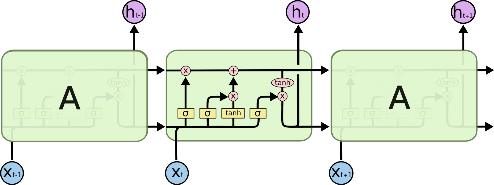
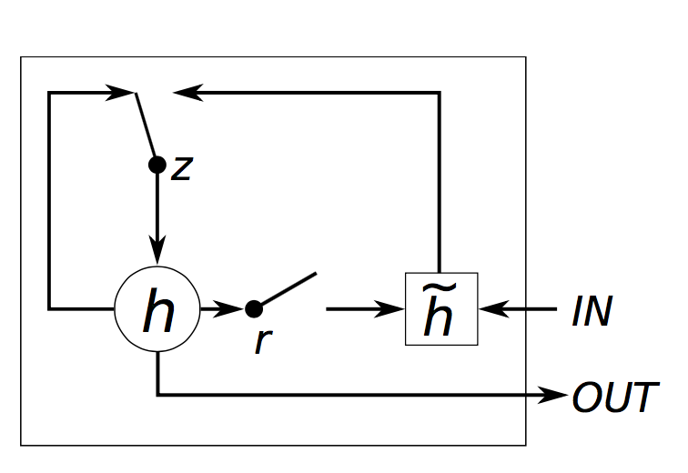
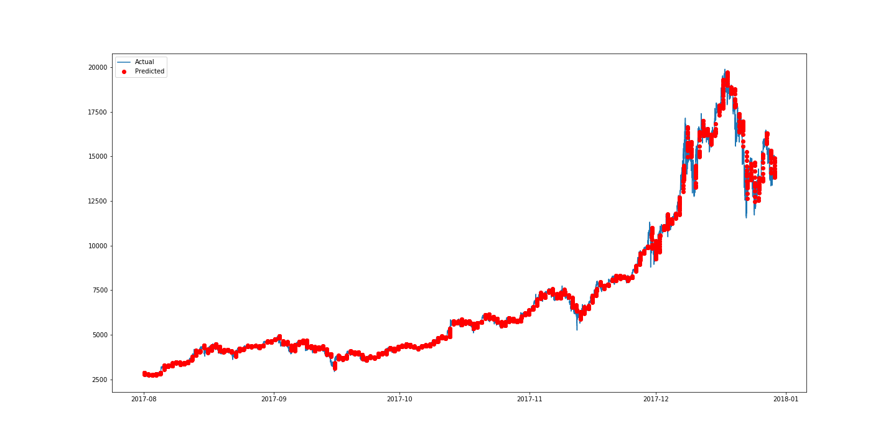
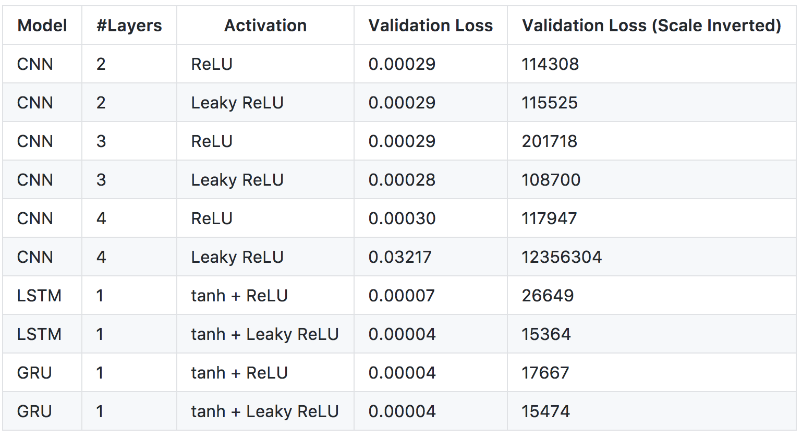

## Tensorflow와 Keras를 활용한 가상화폐 가격 예측하기 💸
[원문 링크](https://medium.com/@huangkh19951228/predicting-cryptocurrency-price-with-tensorflow-and-keras-e1674b0dc58a)
> 이 튜토리얼은 Tensorflow와 Keras를 활용해서 가상화폐 가격을 예측해봅니다.

* Keras
* CNN
* LSTM, GRU

### Introduction

가상화폐, 특히 Bitcoin은 최근 소셜 미디어와 검색 엔진에서 가장 큰 인기를 얻고 있는 것 중 하나입니다. 지능적인 발명 전략을 취한다면 그들(Bitcoin)의 높은 변동성은 높은 수익으로 이어질 수 있습니다! 이제는 전 세계 모든 사람들이 갑자기 가상화폐에 대해 이야기하기 시작한 것 같습니다. 불행히도, index가 부족하기 때문에 기존의 금융상품과 비교할 때 가상화폐는 상대적으로 예측 불가능하죠. 이 튜토리얼은 가상화폐의 미래 추세를 파악하기 위해 Bitcoin을 예로 들어 딥러닝(Deep Learning)으로 이러한 가상화폐의 가격을 예측하는 것을 목표로 합니다.

<br></br>
<br></br>

### Getting Started

아래 코드를 실행하려면 다음 환경과 라이브러리를 설치해야 합니다.

1. Python 2.7
2. Tensorflow=1.2.0
3. Keras=2.1.1
4. Pandas=0.20.3
5. Numpy=1.13.3
6. h5py=2.7.0
7. sklearn=0.19.1

<br></br>
<br></br>

### Data Collection

예측 데이터는 `Kaggle` 또는 `Poloniex`에서 수집할 수 있습니다. 일관성을 유지하기 위해 `Poloniex`에서 수집된 데이터의 열 이름이 `Kaggle`의 열 이름과 일치하도록 변경됩니다.

<br></br>

```python
import json
import numpy as np
import os
import pandas as pd
import urllib2

# poloniex's API에 연결합니다.
url = 'https://poloniex.com/public?command=returnChartData&currencyPair=USDT_BTC&start=1356998100&end=9999999999&period=300'

# API를 통해 얻은 json을 파싱하고, pandas의 DataFrame으로 바꿔줍니다.
openUrl = urllib2.urlopen(url)
r = openUrl.read()
openUrl.close()
d = json.loads(r.decode())
df = pd.DataFrame(d)

original_columns=[u'close', u'date', u'high', u'low', u'open']
new_columns = ['Close','Timestamp','High','Low','Open']
df = df.loc[:,original_columns]
df.columns = new_columns
df.to_csv('data/bitcoin2015to2017.csv',index=None)
view raw
```

<br></br>
<br></br>

### Data Preparation

예측을 위해 소스에서 수집된 데이터를 파싱해야 합니다. 이 [블로그](https://nicholastsmith.wordpress.com/2017/11/13/cryptocurrency-price-prediction-using-deep-learning-in-tensorflow/)의 PastSampler 클래 이용하여 데이터를 분할하여 데이터 리스트와 라벨 리스트를 얻을 수 있습니다. 입력 크기(N)는 256이고 출력 크기(K)는 16입니다. Poloniex에서 수집된 데이터는 5분 단위로 체크 표시됩니다. 이는 입력이 1280분 동안 지속되고 출력이 80분 이상임을 나타냅니다.

<br></br>

```Python
import numpy as np
import pandas as pd

class PastSampler:
    '''
    학습 데이터(training samples)를 과거 데이터를 이용해서 미래를 예측할 수 있도록 형태를 갖춰줍니다.
    '''

    def __init__(self, N, K, sliding_window = True):
        '''
        N개의 과거 데이터를 이용해 K개의 미래를 예측합니다.
        '''
        self.K = K
        self.N = N
        self.sliding_window = sliding_window

    def transform(self, A):
        M = self.N + self.K     #한개의 row당 데이터 개수 (sample + target)
        #indexes
        if self.sliding_window:
            I = np.arange(M) + np.arange(A.shape[0] - M + 1).reshape(-1, 1)
        else:
            if A.shape[0]%M == 0:
                I = np.arange(M)+np.arange(0,A.shape[0],M).reshape(-1,1)

            else:
                I = np.arange(M)+np.arange(0,A.shape[0] -M,M).reshape(-1,1)

        B = A[I].reshape(-1, M * A.shape[1], A.shape[2])
        ci = self.N * A.shape[1]    #한 데이터당 feature 개수
        return B[:, :ci], B[:, ci:] #학습 matrix, 타겟 matrix

#데이터 파일 위치(path)
dfp = 'data/bitcoin2015to2017.csv'

# 가격 데이터 컬럼(열, columns)
columns = ['Close']
df = pd.read_csv(dfp)
time_stamps = df['Timestamp']
df = df.loc[:,columns]
original_df = pd.read_csv(dfp).loc[:,columns]
```

<br></br>

PastSampler 클래스를 만든 후 수집된 데이터에 적용했습니다. 원래 데이터의 범위는 0에서 10000 사이이므로, 신경망이 데이터를 더 쉽게 이해할 수 있도록 데이터 스케일링이 필요합니다.

<br></br>

```Python
file_name='bitcoin2015to2017_close.h5'

from sklearn.preprocessing import MinMaxScaler
scaler = MinMaxScaler()
# normalization
for c in columns:
    df[c] = scaler.fit_transform(df[c].values.reshape(-1,1))

#Features are input sample dimensions(channels)
A = np.array(df)[:,None,:]
original_A = np.array(original_df)[:,None,:]
time_stamps = np.array(time_stamps)[:,None,None]

#Make samples of temporal sequences of pricing data (channel)
NPS, NFS = 256, 16         #과거 데이터, 미래 데이터 개수
ps = PastSampler(NPS, NFS, sliding_window=False)
B, Y = ps.transform(A)
input_times, output_times = ps.transform(time_stamps)
original_B, original_Y = ps.transform(original_A)

import h5py
with h5py.File(file_name, 'w') as f:
    f.create_dataset("inputs", data = B)
    f.create_dataset('outputs', data = Y)
    f.create_dataset("input_times", data = input_times)
    f.create_dataset('output_times', data = output_times)
    f.create_dataset("original_datas", data=np.array(original_df))
    f.create_dataset('original_inputs',data=original_B)
    f.create_dataset('original_outputs',data=original_Y)
```

<br></br>
<br></br>

#### Building Models

##### CNN
1D CNN(Convolutional Neural Network)은 커널이 입력데이터 위를 슬라이딩하면서 지역적인(위치의) 특징을 잘 잡아냅니다. figure1을 한 번 보세요.

<br></br>


*figure1 : CNN Illustration (retrieved from http://cs231n.github.io/convolutional-networks/)*

<br></br>

```Python
import pandas as pd
import numpy as numpy
from keras.models import Sequential
from keras.layers import Dense, Dropout, Activation, Flatten
from keras.layers import Conv1D, MaxPooling1D, LeakyReLU, PReLU
from keras.utils import np_utils
from keras.callbacks import CSVLogger, ModelCheckpoint
import h5py
import os
import tensorflow as tf
from keras.backend.tensorflow_backend import set_session


# 한 개의 GPU만을 사용하도록 설정
os.environ['CUDA_DEVICE_ORDER'] = 'PCI_BUS_ID'
os.environ['CUDA_VISIBLE_DEVICES'] = '1'
os.environ['TF_CPP_MIN_LOG_LEVEL']='2'

config = tf.ConfigProto()
config.gpu_options.allow_growth = True
set_session(tf.Session(config=config))


with h5py.File(''.join(['bitcoin2015to2017_close.h5']), 'r') as hf:
    datas = hf['inputs'].value
    labels = hf['outputs'].value


output_file_name='bitcoin2015to2017_close_CNN_2_relu'

step_size = datas.shape[1]
batch_size= 8
nb_features = datas.shape[2]

epochs = 100

# 데이터를 train, validation 으로 나눔
training_size = int(0.8* datas.shape[0])
training_datas = datas[:training_size,:]
training_labels = labels[:training_size,:]
validation_datas = datas[training_size:,:]
validation_labels = labels[training_size:,:]
#build model

# 2 layers
model = Sequential()


model.add(Conv1D(activation='relu', input_shape=(step_size, nb_features), strides=3, filters=8, kernel_size=20))
model.add(Dropout(0.5))
model.add(Conv1D( strides=4, filters=nb_features, kernel_size=16))

'''
# 3 Layers
model.add(Conv1D(activation='relu', input_shape=(step_size, nb_features), strides=3, filters=8, kernel_size=8))
#model.add(LeakyReLU())
model.add(Dropout(0.5))
model.add(Conv1D(activation='relu', strides=2, filters=8, kernel_size=8))
#model.add(LeakyReLU())
model.add(Dropout(0.5))
model.add(Conv1D( strides=2, filters=nb_features, kernel_size=8))
# 4 layers
model.add(Conv1D(activation='relu', input_shape=(step_size, nb_features), strides=2, filters=8, kernel_size=2))
#model.add(LeakyReLU())
model.add(Dropout(0.5))
model.add(Conv1D(activation='relu', strides=2, filters=8, kernel_size=2))
#model.add(LeakyReLU())
model.add(Dropout(0.5))
model.add(Conv1D(activation='relu', strides=2, filters=8, kernel_size=2))
#model.add(LeakyReLU())
model.add(Dropout(0.5))
model.add(Conv1D( strides=2, filters=nb_features, kernel_size=2))
'''
model.compile(loss='mse', optimizer='adam')
model.fit(training_datas, training_labels,verbose=1, batch_size=batch_size,validation_data=(validation_datas,validation_labels), epochs = epochs, callbacks=[CSVLogger(output_file_name+'.csv', append=True),ModelCheckpoint('weights/'+output_file_name+'-{epoch:02d}-{val_loss:.5f}.hdf5', monitor='val_loss', verbose=1,mode='min')])
```

<br></br>

내가 빌드한 첫 번째 모델은 CNN 입니다. 위의 코드에서는 사용할 GPU 개수를 "1"로 설정합니다(나는 4개의 GPU를 가지고 있지만, 당신은 원하는 만큼의 GPU를 상용할 수 있습니다). 왜냐하면 Tensorflow로 여러개의 GPUs를 사용하는 것은 그다지 잘 돌아가지 않기 때문에, 사용할 GPU를 1개로 제한하는 것이 더 현명한 방법일지도 모릅니다. 당신이 GPU가 없다고해도 걱정하지마세요. GPU를 설정하는 코드를 가뿐히 무시하기만 하면 됩니다.

```Python
os.environ['CUDA_DEVICE_ORDER'] = 'PCI_BUS_ID'
os.environ['CUDA_VISIBLE_DEVICES'] ='1'
os.environ['TF_CPP_MIN_LOG_LEVEL']='2'
```

<br></br>

CNN 모델을 만들기 위한 코드는 아주 간단합니다. dropout 레이어는 overfitting(과적합)을 막아줍니다. loss function(손실함수)는 Mean Squared Error(MSE)로 정의했습니다. optimizer는 Adam을 사용할거에요.

```Python
model = Sequential()
model.add(Conv1D(activation='relu', input_shape=(step_size, nb_features), strides=3, filters=8, kernel_size=20))
model.add(Dropout(0.5))
model.add(Conv1D( strides=4, filters=nb_features, kernel_size=16))
model.compile(loss='mse', optimizer='adam')
```

<br></br>

당신이 걱정해야할 단 한가지는 각 레이어의 입력, 출력 차원(dimension)입니다. 특정 convolutional 계층의 출력을 계산하는 공식은 다음과 같습니다:

> **Output time step = (Input time step — Kernel size) / Strides + 1**

<br></br>

파일의 마지막에, 나는 두개의 callback 함수를 호출할 것입니다. 한 개는 CSVLogger 다른 하나는 ModelCheckpoint 입니다. 첫 번째 CSVLogger 함수는 training, validation 을 트랙킹하는 것을 도와줄 것입니다. 두 번째 ModelCheckpoint 함수는 매 epoch 마다 모델의 가중치(weight)를 저장해 줍니다.

```Python
model.fit(training_datas, training_labels,verbose=1, batch_size=batch_size,validation_data=(validation_datas,validation_labels), epochs = epochs, callbacks=[CSVLogger(output_file_name+'.csv', append=True),ModelCheckpoint('weights/'+output_file_name+'-{epoch:02d}-{val_loss:.5f}.hdf5', monitor='val_loss', verbose=1,mode='min')]
```

<br></br>
<br></br>

#### LSTM

Long Short Term Memory(LSTM) 네트워크는 Recurrent Neural Network(RNN)의 일종입니다. vanilla RNN의 `vanishing gradient problem`을 해결하기 위해 만들어졌습니다. LSTM은 더 긴 시간 동안 입력을 기억할 수 있다고 주장합니다.

<br></br>

> RNN의 `vanishing gradient problem`은 관련된 정보와 그 정보를 참조해야되는 지점(정보를 사용하는 지점)의 사이가 멀어서 Backpropagation(역전파)를 할 때, gradient가 줄어들어 학습 능력이 저하되는 문제입니다. LSTM은 기존의 vanilla RNN에 cell state를 추가하여 과거의 정보가 얼마만큼 유지될 것인지 등을 조절해서 vanishing gradeint problem을 해결합니다.

<br></br>



*figure2 : LSTM Illustration (retrieved from http://colah.github.io/posts/2015-08-Understanding-LSTMs/)*

<br></br>

```Python
import pandas as pd
import numpy as numpy
from keras.models import Sequential
from keras.layers import Dense, Dropout, Activation, Flatten,Reshape
from keras.layers import Conv1D, MaxPooling1D
from keras.utils import np_utils
from keras.layers import LSTM, LeakyReLU
from keras.callbacks import CSVLogger, ModelCheckpoint
import h5py
import os
import tensorflow as tf
from keras.backend.tensorflow_backend import set_session


os.environ['CUDA_DEVICE_ORDER'] = 'PCI_BUS_ID'
os.environ['CUDA_VISIBLE_DEVICES'] = '1'
os.environ['TF_CPP_MIN_LOG_LEVEL']='2'

config = tf.ConfigProto()
config.gpu_options.allow_growth = True
set_session(tf.Session(config=config))

with h5py.File(''.join(['bitcoin2015to2017_close.h5']), 'r') as hf:
    datas = hf['inputs'].value
    labels = hf['outputs'].value


step_size = datas.shape[1]
units= 50
second_units = 30
batch_size = 8
nb_features = datas.shape[2]
epochs = 100
output_size=16
output_file_name='bitcoin2015to2017_close_LSTM_1_tanh_leaky_'
# 데이터를 train, validation 으로 나눔
training_size = int(0.8* datas.shape[0])
training_datas = datas[:training_size,:]
training_labels = labels[:training_size,:,0]
validation_datas = datas[training_size:,:]
validation_labels = labels[training_size:,:,0]


#build model
model = Sequential()
model.add(LSTM(units=units,activation='tanh', input_shape=(step_size,nb_features),return_sequences=False))
model.add(Dropout(0.8))
model.add(Dense(output_size))
model.add(LeakyReLU())
model.compile(loss='mse', optimizer='adam')
model.fit(training_datas, training_labels, batch_size=batch_size,validation_data=(validation_datas,validation_labels), epochs = epochs, callbacks=[CSVLogger(output_file_name+'.csv', append=True),ModelCheckpoint('weights/'+output_file_name+'-{epoch:02d}-{val_loss:.5f}.hdf5', monitor='val_loss', verbose=1,mode='min')])
```

<br></br>

LSTM은 커널 크기, strides, 입력 사이즈 및 출력 사이즈 간의 관계를 신경 쓸 필요가 없으므로 구현이 CNN보다 상대적으로 쉽습니다. 입력 및 출력의 사이즈가 네트워크에서 올바르게 정의되었는지만 확인하세요!

```Python
model = Sequential()
model.add(LSTM(units=units,activation='tanh', input_shape=(step_size,nb_features),return_sequences=False))
model.add(Dropout(0.8))
model.add(Dense(output_size))
model.add(LeakyReLU())
model.compile(loss='mse', optimizer='adam')
```

<br></br>
<br></br>

#### GRU

Gated Recurrent Unit(Gated Recurrent Unit)은 RNN의 또 다른 변형입니다. GRU의 네트워크 구조는 1개의 reset, forget 게이트가 있어서 LSTM보다 덜 정교하지만 GRU의 성능은 LSTM과 동일합니다. 따라서 LSTM 보다 효율성이 더 높다는 주장이 있습니다. (이 튜토리얼에서도 LSTM는 약 45초/epoch, GRU는 40초/epoch 채 걸리지 않기 때문에 주장이 맞다고 할 수 있습니다.)

<br></br>



*GRU Illustration (retrieved from http://www.jackdermody.net/brightwire/article/GRU_Recurrent_Neural_Networks)*

<br></br>

```Python
import pandas as pd
import numpy as numpy
from keras.models import Sequential
from keras.layers import Dense, Dropout, Activation, Flatten,Reshape
from keras.layers import Conv1D, MaxPooling1D, LeakyReLU
from keras.utils import np_utils
from keras.layers import GRU,CuDNNGRU
from keras.callbacks import CSVLogger, ModelCheckpoint
import h5py
import os
import tensorflow as tf
from keras.backend.tensorflow_backend import set_session


os.environ['CUDA_DEVICE_ORDER'] = 'PCI_BUS_ID'
os.environ['CUDA_VISIBLE_DEVICES'] = '1'
os.environ['TF_CPP_MIN_LOG_LEVEL']='2'

config = tf.ConfigProto()
config.gpu_options.allow_growth = True
set_session(tf.Session(config=config))

with h5py.File(''.join(['bitcoin2015to2017_close.h5']), 'r') as hf:
    datas = hf['inputs'].value
    labels = hf['outputs'].value


output_file_name='bitcoin2015to2017_close_GRU_1_tanh_relu_'

step_size = datas.shape[1]
units= 50
batch_size = 8
nb_features = datas.shape[2]
epochs = 100
output_size=16
#split training validation
training_size = int(0.8* datas.shape[0])
training_datas = datas[:training_size,:]
training_labels = labels[:training_size,:,0]
validation_datas = datas[training_size:,:]
validation_labels = labels[training_size:,:,0]

#build model
model = Sequential()
model.add(GRU(units=units, input_shape=(step_size,nb_features),return_sequences=False))
model.add(Activation('tanh'))
model.add(Dropout(0.2))
model.add(Dense(output_size))
model.add(Activation('relu'))
model.compile(loss='mse', optimizer='adam')
model.fit(training_datas, training_labels, batch_size=batch_size,validation_data=(validation_datas,validation_labels), epochs = epochs, callbacks=[CSVLogger(output_file_name+'.csv', append=True),ModelCheckpoint('weights/'+output_file_name+'-{epoch:02d}-{val_loss:.5f}.hdf5', monitor='val_loss', verbose=1,mode='min')])
```

<br></br>

간단하게 LSTM을 빌드하는 두 번째 코드라인을 GRU로 바꾸기만 하면 됩니다.

```Python
model.add(LSTM(units=units,activation='tanh', input_shape=(step_size,nb_features),return_sequences=False))
```

을

```Python
model.add(GRU(units=units,activation='tanh', input_shape=(step_size,nb_features),return_sequences=False))
```

로 바꾸세요!

<br></br>
<br></br>

#### Result Plotting

결과가 세 가지 모델과 모두 비슷하기 때문에 CNN 버전만 보여 드리겠습니다. 먼저 모델을 재구성하고 학습된 가중치를 모델에 로드해야 합니다.

<br></br>

```Python
from keras import applications
from keras.models import Sequential
from keras.models import Model
from keras.layers import Dropout, Flatten, Dense, Activation
from keras.callbacks import CSVLogger
import tensorflow as tf
from scipy.ndimage import imread
import numpy as np
import random
from keras.layers import LSTM
from keras.layers import Conv1D, MaxPooling1D, LeakyReLU
from keras import backend as K
import keras
from keras.callbacks import CSVLogger, ModelCheckpoint
from keras.backend.tensorflow_backend import set_session
from keras import optimizers
import h5py
from sklearn.preprocessing import MinMaxScaler
import os
import pandas as pd
# import matplotlib

import matplotlib.pyplot as plt

os.environ['CUDA_DEVICE_ORDER'] = 'PCI_BUS_ID'
os.environ['CUDA_VISIBLE_DEVICES'] = '0'
os.environ['TF_CPP_MIN_LOG_LEVEL']='2'

with h5py.File(''.join(['bitcoin2015to2017_close.h5']), 'r') as hf:
    datas = hf['inputs'].value
    labels = hf['outputs'].value
    input_times = hf['input_times'].value
    output_times = hf['output_times'].value
    original_inputs = hf['original_inputs'].value
    original_outputs = hf['original_outputs'].value
    original_datas = hf['original_datas'].value


scaler=MinMaxScaler()
#split training validation
training_size = int(0.8* datas.shape[0])
training_datas = datas[:training_size,:,:]
training_labels = labels[:training_size,:,:]
validation_datas = datas[training_size:,:,:]
validation_labels = labels[training_size:,:,:]
validation_original_outputs = original_outputs[training_size:,:,:]
validation_original_inputs = original_inputs[training_size:,:,:]
validation_input_times = input_times[training_size:,:,:]
validation_output_times = output_times[training_size:,:,:]

ground_true = np.append(validation_original_inputs,validation_original_outputs, axis=1)
ground_true_times = np.append(validation_input_times,validation_output_times, axis=1)
step_size = datas.shape[1]
batch_size= 8
nb_features = datas.shape[2]

model = Sequential()

# 2 layers
model.add(Conv1D(activation='relu', input_shape=(step_size, nb_features), strides=3, filters=8, kernel_size=20))
# model.add(LeakyReLU())
model.add(Dropout(0.25))
model.add(Conv1D( strides=4, filters=nb_features, kernel_size=16))
model.load_weights('weights/bitcoin2015to2017_close_CNN_2_relu-44-0.00030.hdf5')
model.compile(loss='mse', optimizer='adam')
```

<br></br>

데이터 프레임에 실제 가격(실제 가격)과 비트코인의 예상 가격이 존재합니다. 시각화를 위해 표시된 수치는 2017년 8월과 그 이후의 데이터만 보여줍니다.

<br></br>

```pythonn
ground_true_df = pd.DataFrame()
ground_true_df['times'] = ground_true_times
ground_true_df['value'] = ground_true

prediction_df = pd.DataFrame()
prediction_df['times'] = validation_output_times
prediction_df['value'] = predicted_inverted

prediction_df = prediction_df.loc[(prediction_df["times"].dt.year == 2017 )&(prediction_df["times"].dt.month > 7 ),: ]
ground_true_df = ground_true_df.loc[(ground_true_df["times"].dt.year == 2017 )&(ground_true_df["times"].dt.month > 7 ),:]
```
<br></br>

pyplot을 이용해서 플롯을 그립니다. 예상 가격은 16분 기준이기 때문에, 그것들 모두를 연결하지 않는 것이 결과가 더 쉽게 이해될 것입니다. 따라서 여기서 예측 데이터는 세 번째 행의 "ro"가 나타내는 빨간색 점으로 표시됩니다. 아래 figure3에 보이는 그래프의 파란색 선은 실제 데이터를 나타내며 빨간색 점은 예상되는 비트코인 가격을 나타냅니다.

```pythonn
plt.figure(figsize=(20,10))
plt.plot(ground_true_df.times,ground_true_df.value, label = 'Actual')
plt.plot(prediction_df.times,prediction_df.value,'ro', label='Predicted')
plt.legend(loc='upper left')
plt.show()
```

<br></br>



*figure3: Best Result Plot for Bitcoin Price Prediction With 2-Layered CNN*

<br></br>

figure3에서 볼 수 있듯이, 예측된 값은 비트코인의 실제 가격과 매우 유사합니다. 가장 좋은 모델을 선택하기 위해, 저는 아래 figure4 표를 만들어서 네트워크의 몇 가지 구성을 테스트하기로 결정했습니다.

<br></br>



*figure4 : Prediction Results for Different Models*

<br></br>
<br></br>

#### 참고자료
[RNN과 LSTM을 이해해보자!](https://ratsgo.github.io/natural%20language%20processing/2017/03/09/rnnlstm/)
