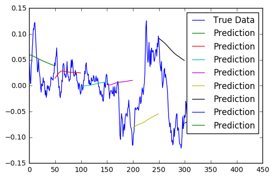

# Keras를 활용한 주식 가격 예측


> 이 문서는 Keras 기반의 딥러닝 모델(LSTM, Q-Learning)을 활용해 주식 가격을 예측하는 튜토리얼입니다. 유명 딥러닝 유투버인 Siraj Raval의 영상을 요약하여 문서로 제작하였습니다. 이 문서를 통해 Keras를 활용하여 간단하고 빠르게 주식 가격을 예측하는 딥러닝 모델을 구현할 수 있습니다.

- 주식 예측

- LSTM

- Q-learning

- 강화학습


모두 부자가 되고 싶지 않으세요? 부자가 되기 위해서는 일해서 얻는 근로 소득 외에도 일하지 않고 얻는 불로 소득(e.g. 투자 이윤)을 확보하는 것이 중요한데요. 프로그래밍을 할 수 있다면 **자동화된 트레이딩 봇**을 통해 불로 소득을 창출할 수 있습니다! 그것도 꽤 간단하게 몇 가지 단계만 거치면 자동화된 트레이딩 봇을 만들 수 있죠. 이 튜토리얼에서는 주식 가격을 예측하거나, 최적화된 거래 시기를 찾아주는 트레이딩 봇을 만드는 방법에 대해 알려드리고자 합니다. 


이 튜토리얼은 같은 주제의 여러 영상을 통합하여 정리한 내용을 담고 있습니다. 튜토리얼에서 쓰인 코드와 주된 설명은 유명 유투버 Siraj Raval를 비롯한 개발자들에 의해 제작되었음을 밝힙니다. 원만한 이해를 돕기 위해 역자가 영상의 내용 및 코드를 적절히 편집하여 다시 작성했습니다. 

이 튜토리얼을 제작하는 데 참고한 원본 영상과 Github Repository는 다음과 같습니다.

|  원본   |  |  |  |
| :-----: | :----------------------------------------------------------: | ------------------------------------------------------------ | ------------------------------------------------------------ |
| Youtube | [How to Predict Stock Prices Easily - Intro to Deep Learning #7](https://www.youtube.com/watch?v=ftMq5ps503w) | [Q Learning for Trading](https://www.youtube.com/watch?v=rRssY6FrTvU) | [Reinforcement Learning for Stock Prediction](https://www.youtube.com/watch?v=05NqKJ0v7EE) |
| GitHub  | https://github.com/llSourcell/How-to-Predict-Stock-Prices-Easily-Demo | https://github.com/llSourcell/Q-Learning-for-Trading         | https://github.com/llSourcell/Reinforcement_Learning_for_Stock_Prediction |
|  내용   |             LSTM을 활용하여 S&P 500의 종가 예측              | Q-Learning을 활용하여 S&P 500의 종가 예측                    | Q-Learning을 활용하여 S&P 500의 종가 예측                    |


## LSTM을 활용한 S&P 종가 예측

> 유의: 이 코드는 python 2를 기반으로 작성되었습니다. 만약 python 3에서 실행하고 싶으시다면 `lstm.py` 코드 내의 `print`와 `xrange` 함수만 적절히 수정해주시면 가능합니다.

### 사용할 데이터

우리는 S&P 500 지수 데이터를 사용하려고 합니다. S&P 500이란 국제 신용평가기관인 미국의 스탠다드 푸어스(Standard & Poors, 약칭 S&P)가 작성한 주가 지수로, 500개 대형기업(대부분이 미국 기업)의 주식을 포함한 지수입니다. 우리가 사용할 데이터는 `sp500.csv` 파일에 들어있으며, S&P 500의 2000년 1월부터 2016년 8월까지의 종가(장 마감 시점의 가격)로 구성되어 있습니다. 


### 데이터 불러오기 및 전처리

```python
from keras.layers.core import Dense, Activation, Dropout
from keras.layers.recurrent import LSTM
from keras.models import Sequential
import lstm, time #도움을 주는 라이브러리들
```

`lstm.py`에는 데이터를 불러오는 `load_data`나 전처리를 해주는 `normalise_windows`과 같은 유용한 함수들이 미리 작성되어 있습니다. 이런 함수들을 활용해 빠르고 간단하게 모델 생성과 전처리를 진행해봅니다.


```python
#1단계: 데이터 불러오기
X_train, y_train, X_test, y_test = lstm.load_data('sp500.csv', 50, True)
#데이터 확인
print(X_train)
```

=> [[\[0.][0.00751348]\[0.00370998]...,[0.02149596]\[0.01727155]\[0.02352239]]]]...

데이터를 불러온 후 출력해보면, 0부터 1사이의 값으로 이루어져 있다는 것을 알 수 있습니다.

이는 `load_data`내의 `normalise_windows` 함수에서 먼저 `정규화(normalization)`를 해주기 때문인데요. 신경망이 빠르고 수월하게 학습하려면 데이터들을 -1과 1 사이의 값으로 작게 만들어야 합니다. 그래서 우리가 다루려는 S&P 500 데이터의 경우  첫 데이터인 2000년 1월 첫 거래일의 종가를 기준으로 각 종가가 얼마나 증가했는지 그 비율을 구해줍니다. 이런 방법을 통해 주가 데이터의 `정규화`를 할 수 있습니다. 코드와 수식으로 표현하자면 다음과 같습니다.

```python
def normalise_windows(window_data):
    normalised_data = []
    for window in window_data:
        normalised_window = [((float(p) / float(window[0])) - 1) for p in window]
        normalised_data.append(normalised_window)
    return normalised_data
```


이 때 p_i는 변환하고자 하는 종가, p_0는 첫 거래일의 종가를 뜻합니다. 학습 후 예측한 값을 다시 비율이 아닌 원래 값으로 되돌리고 싶다면(denormalization), 다음과 같은 수식을 활용하면 됩니다.


###모델 생성과 학습

다음은 모델을 생성해볼 차례입니다. 우리는 `LSTM(Long Short Term Memory)` 모델을 사용하려고 합니다. `LSTM`을 사용하려는 이유는 주가 데이터가 순서가 있는 `시계열(Time-series)` 데이터이기 때문입니다.


~ LSTM 간단한 설명 ~


다음과 같은 코드로 `LSTM` 모델을 생성합니다.

```python
#2단계: 모델 생성
model = Sequential()

model.add(LSTM(
    input_dim=1,
    output_dim=50,
    return_sequences=True))
model.add(Dropout(0.2))

model.add(LSTM(
    100,
    return_sequences=False))
model.add(Dropout(0.2))

model.add(Dense(
    output_dim=1))
model.add(Activation('linear'))

start = time.time()
model.compile(loss='mse', optimizer='rmsprop')
print 'compilation time : ', time.time() - start
```

입력으로 들어가는 데이터는 1차원이기 때문에 이 에 따라 `input_dim`을 설정합니다. 다음 `LSTM` 레이어로 들어가는 입력값을 설정하기 위해 `output_dim` 값을 정하고 `return_sequences`을 `True`로 설정해줍니다. 또 `과적합(overfitting)`을 피하기 위한 `드롭아웃(dropout)`을 20%로 설정합니다. 

다음 `LSTM` 레이어에서는 노드를 100개, 그리고 마지막 `Dense` 레이어에 들어가기 전이므로 `return_sequences`를 `False`로 설정해줍니다. 마찬가지로 `과적합(overfitting)`을 피하기 위해 `드롭아웃(dropout)`을 20%로 설정합니다. 

마지막으로 `Dense` 레이어와 `linear` 활성화 함수(activation function)을 통해 마지막 결과값을 계산해줍니다.

그리고 모델의 학습 과정을 정해주는데요. `회귀(Regression)` 문제를 풀 때 가장 일반적인 `손실 함수(loss function)`인 `평균 제곱근 편차(Mean Squared Error, MSE)`를 설정하고, `최적화 방법(Optimization)`으로는 `RMSProp`을 설정해줍니다.


그 후 다음과 같은 코드를 통해 모델을 학습합니다.

```python
#3단계: 모델 학습
model.fit(
    X_train,
    y_train,
    batch_size=512,
    nb_epoch=1,
    validation_split=0.05)
```


### 주가 예측 시각화하기

다음과 같은 코드를 통해 앞으로의 추세를 그려볼 수 있습니다.

```python
#4단계: 주가 예측한 것을 그려보자!
predictions = lstm.predict_sequences_multiple(model, X_test, 50, 50)
lstm.plot_results_multiple(predictions, y_test, 50)
```

=>



간단한 학습만으로도 비교적 잘 예측하는 모습을 보여줍니다. 자, 그럼 이제 돈을 벌러 가 볼까요?


## 강화학습을 활용한 주식 가격 예측

과연 구글(Google) 주식을 과거 가격 데이터셋에 기반하여 예측하는 것이 가능할까요?

이 질문에 대해 파이썬과 케라스를 활용해 


## 참고 자료

Siraj Raval의 주식 가격 예측 관련 유투브 영상과 코드 바로가기

|                           Youtube                            |                            Github                            |                   내용                    |
| :----------------------------------------------------------: | :----------------------------------------------------------: | :---------------------------------------: |
| [How to Predict Stock Prices Easily - Intro to Deep Learning #7](https://www.youtube.com/watch?v=ftMq5ps503w) | https://github.com/llSourcell/How-to-Predict-Stock-Prices-Easily-Demo |    LSTM을 활용하여 S&P 500의 종가 예측    |
| [Q Learning for Trading](https://www.youtube.com/watch?v=rRssY6FrTvU) |     https://github.com/llSourcell/Q-Learning-for-Trading     | Q-Learning을 활용하여 S&P 500의 종가 예측 |
| [Reinforcement Learning for Stock Prediction](https://www.youtube.com/watch?v=05NqKJ0v7EE) | https://github.com/llSourcell/Reinforcement_Learning_for_Stock_Prediction | Q-Learning을 활용하여 S&P 500의 종가 예측 |

