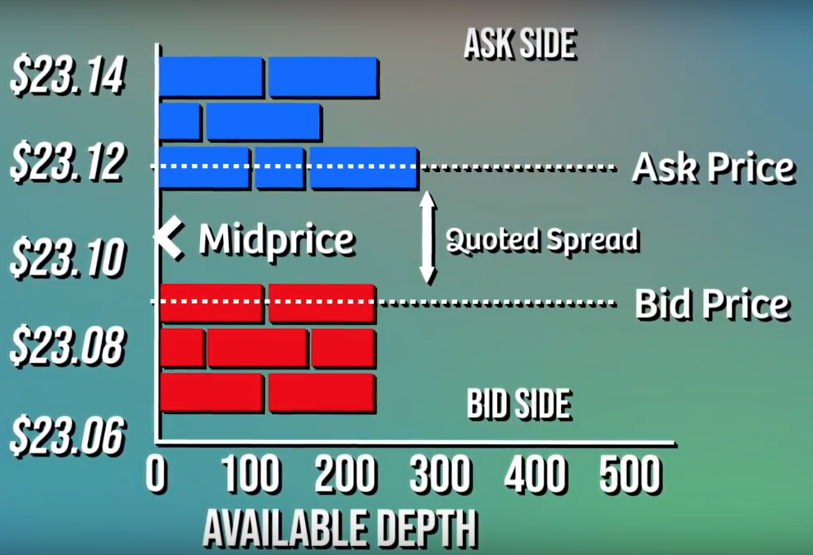
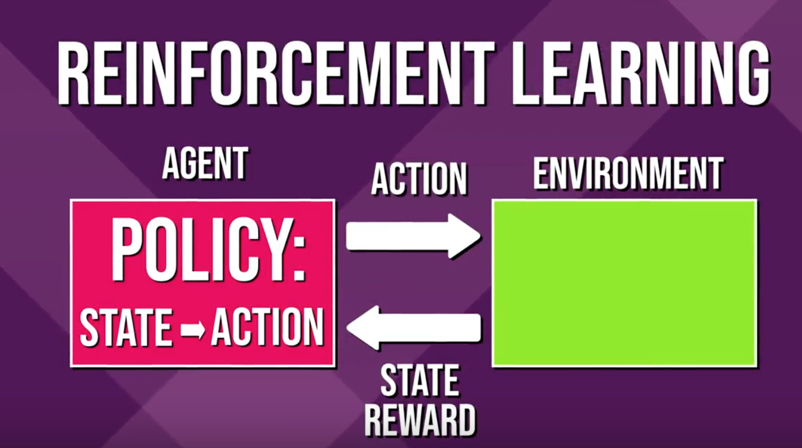
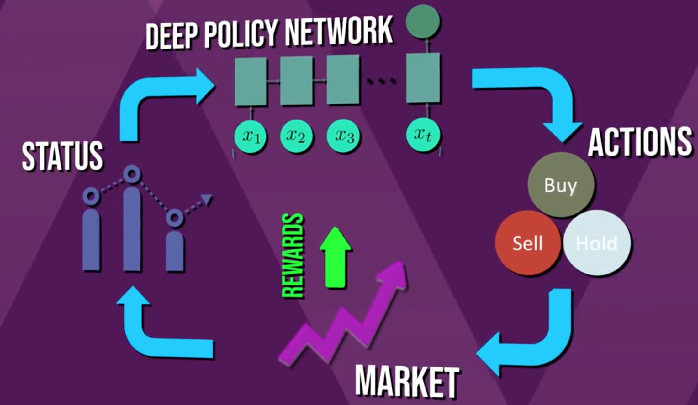
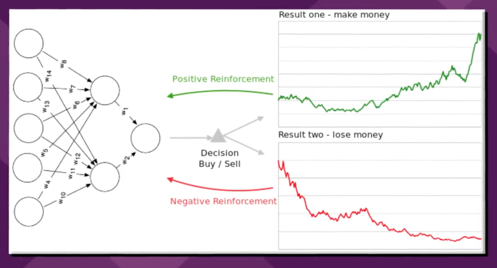

# Keras를 활용한 주식 가격 예측


> 이 문서는 Keras 기반의 딥러닝 모델(LSTM, Q-Learning)을 활용해 주식 가격을 예측하는 튜토리얼입니다. 유명 딥러닝 유투버인 Siraj Raval의 영상을 요약하여 문서로 제작하였습니다. 이 문서를 통해 Keras를 활용하여 간단하고 빠르게 주식 가격을 예측하는 딥러닝 모델을 구현할 수 있습니다.

- 주식 예측

- LSTM

- Q-learning

- 강화학습


모두 부자가 되고 싶지 않으세요? 부자가 되기 위해서는 일해서 얻는 근로 소득 외에도 일하지 않고 얻는 불로 소득(e.g. 투자 이윤)을 확보하는 것이 중요한데요. 프로그래밍을 할 수 있다면 **자동화된 트레이딩 봇**을 통해 불로 소득을 창출할 수 있습니다! 그것도 꽤 간단하게 몇 가지 단계만 거치면 자동화된 트레이딩 봇을 만들 수 있죠. 이 튜토리얼에서는 주식 가격을 예측하거나, 최적화된 거래 시기를 찾아주는 트레이딩 봇을 만드는 방법에 대해 알려드리고자 합니다. 


이 튜토리얼은 같은 주제의 여러 영상을 통합하여 정리한 내용을 담고 있습니다. 튜토리얼에서 쓰인 코드와 주된 설명은 유명 유투버 Siraj Raval를 비롯한 개발자들에 의해 제작되었음을 밝힙니다. 원만한 이해를 돕기 위해 역자가 영상의 내용 및 코드를 적절히 편집하여 다시 작성했습니다. 역자의 개인적인 의견도 다수 포함되어 있습니다.

이 튜토리얼을 제작하는 데 참고한 원본 영상과 Github Repository는 다음과 같습니다.

|  원본   |  |  |  |
| :-----: | :----------------------------------------------------------: | ------------------------------------------------------------ | ------------------------------------------------------------ |
| Youtube | [How to Predict Stock Prices Easily - Intro to Deep Learning #7](https://www.youtube.com/watch?v=ftMq5ps503w) | [Q Learning for Trading](https://www.youtube.com/watch?v=rRssY6FrTvU) | [Reinforcement Learning for Stock Prediction](https://www.youtube.com/watch?v=05NqKJ0v7EE) |
| GitHub  | https://github.com/llSourcell/How-to-Predict-Stock-Prices-Easily-Demo | https://github.com/llSourcell/Q-Learning-for-Trading         | https://github.com/llSourcell/Reinforcement_Learning_for_Stock_Prediction |
|  내용   |             LSTM을 활용하여 S&P 500의 종가 예측              | Q-Learning을 활용하여 S&P 500의 종가 예측                    | Q-Learning을 활용하여 S&P 500의 종가 예측                    |


## LSTM을 활용한 S&P 종가 예측

> 유의: 이 코드는 python 2를 기반으로 작성되었습니다. 만약 python 3에서 실행하고 싶으시다면 `lstm.py` 코드 내의 `print`와 `xrange` 함수만 적절히 수정해주시면 가능합니다.

### 사용할 데이터

우리는 S&P 500 지수 데이터를 사용하려고 합니다. S&P 500이란 국제 신용평가기관인 미국의 스탠다드 푸어스(Standard & Poors, 약칭 S&P)가 작성한 주가 지수로, 500개 대형기업(대부분이 미국 기업)의 주식을 포함한 지수입니다. 우리가 사용할 데이터는 `sp500.csv` 파일에 들어있으며, S&P 500의 2000년 1월부터 2016년 8월까지의 종가(장 마감 시점의 가격)로 구성되어 있습니다. 


### 데이터 불러오기 및 전처리

```python
from keras.layers.core import Dense, Activation, Dropout
from keras.layers.recurrent import LSTM
from keras.models import Sequential
import lstm, time #도움을 주는 라이브러리들
```

`lstm.py`에는 데이터를 불러오는 `load_data`나 전처리를 해주는 `normalise_windows`과 같은 유용한 함수들이 미리 작성되어 있습니다. 이런 함수들을 활용해 빠르고 간단하게 모델 생성과 전처리를 진행해봅니다.


```python
#1단계: 데이터 불러오기
X_train, y_train, X_test, y_test = lstm.load_data('sp500.csv', 50, True)
#데이터 확인
print(X_train)
```

=> [[\[0.][0.00751348]\[0.00370998]...,[0.02149596]\[0.01727155]\[0.02352239]]]]...

데이터를 불러온 후 출력해보면, 0부터 1사이의 값으로 이루어져 있다는 것을 알 수 있습니다.

이는 `load_data`내의 `normalise_windows` 함수에서 먼저 `정규화(normalization)`를 해주기 때문인데요. 신경망이 빠르고 수월하게 학습하려면 데이터들을 -1과 1 사이의 값으로 작게 만들어야 합니다. 그래서 우리가 다루려는 S&P 500 데이터의 경우  첫 데이터인 2000년 1월 첫 거래일의 종가를 기준으로 각 종가가 얼마나 증가했는지 그 비율을 구해줍니다. 이런 방법을 통해 주가 데이터의 `정규화`를 할 수 있습니다. 코드와 수식으로 표현하자면 다음과 같습니다.

```python
def normalise_windows(window_data):
    normalised_data = []
    for window in window_data:
        normalised_window = [((float(p) / float(window[0])) - 1) for p in window]
        normalised_data.append(normalised_window)
    return normalised_data
```


이 때 p_i는 변환하고자 하는 종가, p_0는 첫 거래일의 종가를 뜻합니다. 학습 후 예측한 값을 다시 비율이 아닌 원래 값으로 되돌리고 싶다면(denormalization), 다음과 같은 수식을 활용하면 됩니다.


### 모델 생성과 학습

다음은 모델을 생성해볼 차례입니다. 우리는 `LSTM(Long Short Term Memory)` 모델을 사용하려고 합니다. `LSTM`을 사용하려는 이유는 주가 데이터가 순서가 있는 `시계열(Time-series)` 데이터이기 때문입니다.


~ LSTM 간단한 설명 ~


다음과 같은 코드로 `LSTM` 모델을 생성합니다.

```python
#2단계: 모델 생성
model = Sequential()

model.add(LSTM(
    input_dim=1,
    output_dim=50,
    return_sequences=True))
model.add(Dropout(0.2))

model.add(LSTM(
    100,
    return_sequences=False))
model.add(Dropout(0.2))

model.add(Dense(
    output_dim=1))
model.add(Activation('linear'))

start = time.time()
model.compile(loss='mse', optimizer='rmsprop')
print 'compilation time : ', time.time() - start
```

입력으로 들어가는 데이터는 1차원이기 때문에 이 에 따라 `input_dim`을 설정합니다. 다음 `LSTM` 레이어로 들어가는 입력값을 설정하기 위해 `output_dim` 값을 정하고 `return_sequences`을 `True`로 설정해줍니다. 또 `과적합(overfitting)`을 피하기 위한 `드롭아웃(dropout)`을 20%로 설정합니다. 

다음 `LSTM` 레이어에서는 노드를 100개, 그리고 마지막 `Dense` 레이어에 들어가기 전이므로 `return_sequences`를 `False`로 설정해줍니다. 마찬가지로 `과적합(overfitting)`을 피하기 위해 `드롭아웃(dropout)`을 20%로 설정합니다. 

마지막으로 `Dense` 레이어와 `linear` 활성화 함수(activation function)을 통해 마지막 결과값을 계산해줍니다.

그리고 모델의 학습 과정을 정해주는데요. `회귀(Regression)` 문제를 풀 때 가장 일반적인 `손실 함수(loss function)`인 `평균 제곱근 편차(Mean Squared Error, MSE)`를 설정하고, `최적화 방법(Optimization)`으로는 `RMSProp`을 설정해줍니다.


그 후 다음과 같은 코드를 통해 모델을 학습합니다.

```python
#3단계: 모델 학습
model.fit(
    X_train,
    y_train,
    batch_size=512,
    nb_epoch=1,
    validation_split=0.05)
```


### 주가 예측 시각화하기

다음과 같은 코드를 통해 앞으로의 추세를 그려볼 수 있습니다.

```python
#4단계: 주가 예측한 것을 그려보자!
predictions = lstm.predict_sequences_multiple(model, X_test, 50, 50)
lstm.plot_results_multiple(predictions, y_test, 50)
```

=>


간단한 학습만으로도 비교적 잘 예측하는 모습을 보여줍니다. 자, 그럼 이제 돈을 벌러 가 볼까요?


## `강화학습`을 활용한 주식 가격 예측

자, 이번엔 `강화학습`을 주식 시장에 적용해볼까요?

다만 `강화학습`을 활용하기 전에, 먼저 `지도학습(supervised)` 으로 학습시킨 딥러닝 모델을 활용한 트레이딩 방법에 대해 알아보도록 하겠습니다. 그리고 나서 둘을 비교해보도록 하죠.

### `지도학습`모델을 활용한 트레이딩 방법

만약에 주식 가격이 올라갈 것이라고 예측한다면, 주식을 지금 산 뒤 오르고 나서 팔면 됩니다. 반대로, 주식 가격이 내려갈 것 같으면, 공매도(주식을 빌려서 팔고 일정 시간이 지난 뒤 다시 사서 돌려주는 것)를 해서 지금 팔고 나중에 가격이 내려간 뒤 사면 됩니다. 그렇다면 문제는, **'어떻게 주식을 예측할 것인가'** 겠죠? 사실 주식 가격은 그렇게 쉽게 정해지는 것이 아닙니다. 우리가 어떤 주식을 검색했을 때 당장 보이는 가격, 그 하나의 가격에 우리가 원하는 모든 주식의 수량만큼 살 수는 없습니다. 우리가 실제로 사게 되는 주식의 가격은 지금 당장 시장에서 거래되는 주식의 거래량에 따라, 호가창에 나와 있는 매수/매도 잔량에 따라, 또 거래 수수료에 따라 달라지기 마련이죠.



그래서 우리는 `지도학습`으로 주식 가격을 예측할 때는 호가창 내의 중간 가격(Midprice)을 예측하려고 합니다. 사실 이 가격은 우리가 주식을 주문했을 때 실제 체결되는 정확한 가격은 아니지만, 이론적으로 현재 매수와 매도 가격의 중간 가격이기 때문에 중요합니다. 현재 호가창의 상태가 어떤지에 따라 그 매수-매도 사이의 가격 스프레드(spread)는 크게 차이가 날 수 있습니다.


주의해야 할 점은, 우리가 지금 딥러닝 모델을 활용해 가격을 예측하려고 하지만, 이 모델은 네트워크 지연 시간(network latency), 수수료, 가장 유리한 호가 수준에서의 유동성 등을 고려하지 않는다는 점입니다. 그래서 이런 단순한 주가 예측 전략으로 돈을 벌기 위해서는 장기적으로 봤을 때의 큰 가격 변동을 예측하거나, 수수료 또는 매수/매도 주문 관리를 똑똑하게 하는 것이 필요합니다. 하지만 이것은 쉬운 문제가 아니죠.

그리고 만약 `지도학습`으로 학습을 시켰다면, 전략의 변화가 없기 때문에 생기는 문제도 있습니다. 운이 좋게 우리가 예측한 대로 가격이 오르면 좋겠지만, 만약 그게 아니라 가격이 내려간다면 어떻게 해야 할까요? 혼란에 빠진 짐승처럼 주식을 가져다 팔아야 할까요? 만약 가격이 올랐다가 다시 내려가는 경우는 어떨까요? 또, 우리가 주식 매수/매도 주문을 넣기 위해서는 모델이 얼마 정도의 확신(certainty)를 가질 때를 기준으로 해야 할까요? 

그래서 우리는 단순히 주식 가격을 예측하는 것 이상의 모델을 만들어야 합니다. 모델이 예측한 주식 가격을 입력받아 매수/매도 주문을 넣을지, 그냥 관망할지, ~~춤을 출지~~ 등의 행동을 결정하는  `규칙 기반의 정책(Rule based policy)`이 필요합니다. 하지만 어떻게 이 모든 정책에 필요한 파라미터(policy parameter)를 최적화할 수 있을까요? 휴리스틱이나 인간의 직관은 이런 것을 결정하는 데 약간의 도움만 될 뿐입니다.


### `강화학습`을 활용한 트레이딩 방법

그렇다면 이에 대한 해결책은.. `강화학습`을 활용한 트레이딩입니다. 다음과 같은 방식으로 `강화학습` 문제를 설계할 수 있는데요.





#### 강화학습이란?

- `환경(Environment)` 내에서 `행동(action)`을 취하는 `에이전트(agent)`가 있습니다. 

- 이 `에이전트`는 매 시간 단위(time step)마다 현재 `상태(state)`를 입력으로 받고, `행동`을 취한 뒤 이에 따른 `보상(reward)`과 다음 `상태`를 받습니다. 

- 이 `에이전트`는  `정책(policy)`에 따라 어떤 `행동`을 할지를 결정하는데요. 

- 우리의 목표는 주어진 기간 동안 누적 `보상`을 최대한으로 얻는 `정책`을 찾아내는 것입니다. 




#### 주식 시장에서의 강화학습이란?

주식 시장에서의 관점으로는, 

- `에이전트`가 바로 우리가 만드려는 트레이딩 봇이고, 
- 이것이 언제 주식을 사고 팔지를 결정하는 `행동`을 하며,
-  `환경`은 우리가 주식을 사고파는 시장이 됩니다. 
- 이 환경의 `상태`에 대해 설명하자면, 완전정보적(complete)이지 않습니다. 우리는 다른 `에이전트`들에 대해서 자세히 알 수 없고, 계좌 잔액이나 그들이 넣은 대기 주문에 대해서도 알 수 없죠. 우리가 관찰할 수 있는 것은 `환경` 내의 정확한 `상태`라기보다는 그것에서부터 파생된 제한적인 정보를 가진 `상태`인 것입니다. 

- 매 시간 단위마다 우리가 알 수 있는 것은 그때까지 체결된 거래 기록들과 우리의 계좌 잔액 정도입니다.

트레이딩 봇이 거래하는 시간 간격도 상당히 중요한데요, 며칠 간격으로 거래를 해야 할까요? 나노 초(ns) 단위는 어떤가요? 초단타매매용 트레이딩 봇은 나노 초 단위로 거래합니다.




딥러닝은 복잡한 문제를 풀 수 있는 것으로 잘 알려져 있습니다. 많은 데이터를 입력으로 받아 학습하여 패턴을 찾죠. 그러나 딥러닝은 상대적으로 느립니다. 나노 초 단위로 결정을 내릴 수는 없기 때문에, 초단타매매용 봇을 이길 수는 없죠. 

그래서 우리는 사람이 데이터를 분석하는 것보다 빠르게 결정을 내리며 (물론 초단타매매매처럼 나노 초 단위까지는 가지 못하겠지만요), 대신 더 똑똑하여 초단타매매용 봇을 이길 수 있는 트레이딩 봇을 만들고자 합니다.

사실 `강화학습`의 트레이딩 전략은 어떤 측면에서는 `지도학습` 방식의 트레이딩 전략보다 간단할 수도 있습니다. `지도학습`은 가격을 예측하는 모델 외에도 직접 수작업으로 만든 `규칙 기반의 정책`(예-모델이 80% 이상의 확신을 할 때 사거나 팔기, ~~스카이넷 작동시키기~~)이 필요합니다. 하지만 `강화학습`은 그런 것이 모두 학습한 `정책` 내에 포함되어 있습니다. 그래서 더 강력하고 사람을 뛰어넘을 수도 있죠. 또 네트워크 지연이나 실수 같은 것까지 `환경` 내에서 시뮬레이션하여 트레이딩 봇을 학습시킬 수도 있습니다. 


> 이 글은 2018 컨트리뷰톤에서 [`Contributue to Keras`](https://github.com/KerasKorea/KEKOxTutorial) 프로젝트로 진행했습니다.
>
>
>
> Translator : [karl6885](https://github.com/karl6885)(김영규)
>
>
>
> Translator Email : karl6885@gmail.com

